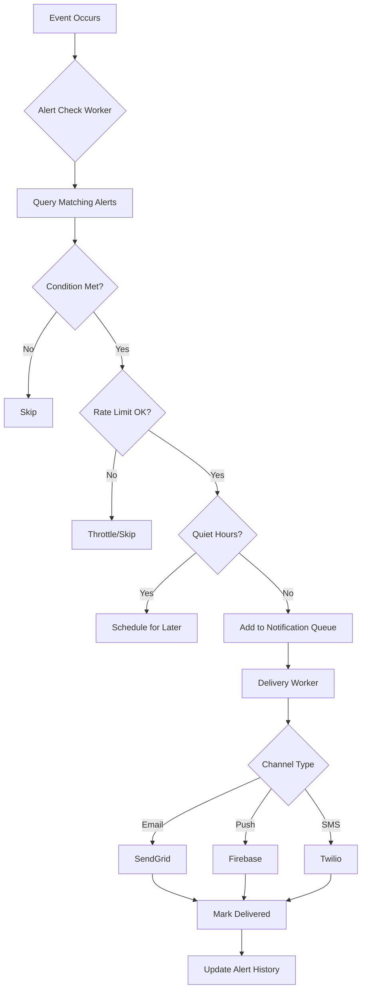

# Alert & Notification System Specification

**Document Version:** 1.0
**Last Updated:** 2025-10-07
**Owner:** Backend Team
**Status:** Draft

---

## Table of Contents

1. [Executive Summary](#executive-summary)
2. [Alert Types](#alert-types)
3. [Alert Configuration](#alert-configuration)
4. [Triggering Logic](#triggering-logic)
5. [Notification Channels](#notification-channels)
6. [System Architecture](#system-architecture)
7. [Database Schema](#database-schema)
8. [API Specification](#api-specification)
9. [Rate Limiting & Throttling](#rate-limiting--throttling)
10. [Testing Strategy](#testing-strategy)

---

## 1. Executive Summary

The **Alert & Notification System** enables users to receive real-time notifications when specific portfolio events occur (price movements, risk changes, AI predictions, etc.).

**Key Features:**
- 6 alert types (price, risk, prediction, portfolio value, whale moves, news)
- Multi-channel delivery (email, push, SMS, in-app)
- User-configurable thresholds and conditions
- Smart throttling to prevent notification spam
- Tier-based limits (Free: 5 alerts, Power Trader: unlimited)

**Architecture:**
- Event-driven system using Redis Pub/Sub
- Background workers process alert checks
- Queue-based delivery with retry logic
- Supports 100,000+ active alerts across users

---

## 2. Alert Types

### 2.1 Price Alerts

**Trigger Conditions:**
- Asset price crosses specific threshold (e.g., "BTC > $50,000")
- Percentage change over time period (e.g., "ETH down 10% in 1 hour")
- All-time high/low reached

**Configuration:**
```json
{
  "type": "price_alert",
  "asset_symbol": "BTC",
  "condition": "above",
  "threshold_usd": 50000,
  "notification_channels": ["email", "push"]
}
```

**Example Alerts:**
- "🚀 BTC just crossed $50,000! Current price: $50,245"
- "⚠️ ETH dropped 10% in the last hour (now $2,340)"
- "🎉 SOL reached a new all-time high of $145.67"

---

### 2.2 Risk Score Alerts

**Trigger Conditions:**
- Individual asset risk score exceeds threshold
- Portfolio-wide risk score exceeds threshold
- Sudden risk score increase (e.g., +20 points in 24h)

**Configuration:**
```json
{
  "type": "risk_alert",
  "scope": "portfolio",
  "condition": "above",
  "threshold_score": 60,
  "notification_channels": ["email", "in_app"]
}
```

**Example Alerts:**
- "⚠️ Your portfolio risk score increased to 72 (was 54 yesterday)"
- "🔴 SHIB risk score is now 88 (Extreme Risk tier)"
- "⚠️ 3 of your holdings now have risk scores above 75"

---

### 2.3 AI Prediction Alerts

**Trigger Conditions:**
- New prediction generated for watched asset
- Prediction direction changes (bullish → bearish)
- High-confidence prediction (>80% confidence)

**Configuration:**
```json
{
  "type": "prediction_alert",
  "asset_symbol": "ETH",
  "prediction_direction": "any",
  "min_confidence": 75,
  "notification_channels": ["push", "in_app"]
}
```

**Example Alerts:**
- "🔮 New 7-day prediction for ETH: BULLISH (82% confidence, +$340 expected)"
- "⚠️ BTC prediction changed from BULLISH to BEARISH (68% confidence)"
- "🎯 High-confidence prediction: SOL expected to gain 15% (85% confidence)"

---

### 2.4 Portfolio Value Alerts

**Trigger Conditions:**
- Total portfolio value crosses milestone ($10K, $100K, $1M)
- Portfolio gain/loss exceeds percentage (e.g., "down 5% today")
- Specific holding becomes top 3 by value

**Configuration:**
```json
{
  "type": "portfolio_value_alert",
  "condition": "above",
  "threshold_usd": 100000,
  "notification_channels": ["email", "push", "sms"]
}
```

**Example Alerts:**
- "🎉 Congratulations! Your portfolio just crossed $100,000!"
- "⚠️ Your portfolio is down 5.2% today (-$4,830)"
- "📊 BTC is now your largest holding (45% of portfolio)"

---

### 2.5 Whale Activity Alerts

**Trigger Conditions:**
- Large wallet moves asset you hold (>$10M transaction)
- Exchange inflows/outflows spike (potential dump/pump)
- Top holder changes (concentration risk)

**Configuration:**
```json
{
  "type": "whale_alert",
  "asset_symbol": "ETH",
  "min_transaction_usd": 10000000,
  "notification_channels": ["push"]
}
```

**Example Alerts:**
- "🐋 Large ETH transfer detected: 50,000 ETH ($120M) moved to Binance"
- "⚠️ 1 billion SHIB ($25M) transferred from exchange (potential pump?)"
- "🔴 Top 10 BTC holders now control 15% (up from 12% last week)"

**Note:** This is a **PLUS tier feature** (not available to Free users).

---

### 2.6 News & Event Alerts

**Trigger Conditions:**
- Breaking news mentions asset you hold (via CoinGecko/LunarCrush)
- Regulatory announcement (SEC, government)
- Major partnership/integration announced

**Configuration:**
```json
{
  "type": "news_alert",
  "asset_symbol": "ADA",
  "keywords": ["partnership", "regulation", "upgrade"],
  "notification_channels": ["email", "in_app"]
}
```

**Example Alerts:**
- "📰 Breaking: SEC announces new crypto regulation affecting ETH"
- "🤝 Cardano announces major partnership with Fortune 500 company"
- "🔧 Ethereum 2.0 upgrade scheduled for next week"

**Note:** This is a **PRO tier feature** (not available to Free/Plus users).

---

## 3. Alert Configuration

### 3.1 User Alert Limits by Tier

| Tier | Max Active Alerts | Alert Types Available | Channels |
|------|-------------------|----------------------|----------|
| **Free** | 5 | Price, Risk, Portfolio Value | Email, In-App |
| **Plus** ($9/mo) | 20 | + AI Prediction, Whale Activity | + Push Notifications |
| **Pro** ($29/mo) | 50 | + News & Events | + SMS (10/month) |
| **Power Trader** ($99/mo) | Unlimited | All types | All channels (unlimited) |

### 3.2 Alert Settings UI

**User Controls:**
- Enable/disable individual alerts
- Set notification channels per alert
- Configure quiet hours (e.g., "no notifications 10pm-7am")
- Snooze alerts temporarily (1 hour, 24 hours, 1 week)
- Frequency limits (e.g., "max 1 alert per asset per hour")

**Example Settings Page:**
```
┌─ My Alerts ──────────────────────────────────┐
│                                               │
│ [✓] BTC Price > $50,000                       │
│     📧 Email  📱 Push  ❌ SMS                  │
│     Last triggered: Never                     │
│     [Edit] [Delete] [Snooze]                  │
│                                               │
│ [✓] Portfolio Risk > 60                       │
│     📧 Email  ❌ Push  ❌ SMS                  │
│     Last triggered: 2 hours ago               │
│     [Edit] [Delete] [Snooze]                  │
│                                               │
│ [Add New Alert] (3/5 used - Upgrade for more) │
│                                               │
│ Quiet Hours: 10:00 PM - 7:00 AM               │
│ Rate Limit: Max 5 notifications per hour      │
│                                               │
└───────────────────────────────────────────────┘
```

---

## 4. Triggering Logic

### 4.1 Alert Check Workflow



### 4.2 Price Alert Logic

**Check Frequency:** Every 30 seconds (via WebSocket price updates)

```python
def check_price_alerts(price_update: PriceUpdate):
    """
    Triggered when new price data arrives via WebSocket
    """
    asset_symbol = price_update.symbol
    current_price = price_update.price

    # Find all active price alerts for this asset
    alerts = db.query(
        "SELECT * FROM alerts WHERE type = 'price_alert' "
        "AND asset_symbol = %s AND is_active = true",
        (asset_symbol,)
    )

    for alert in alerts:
        triggered = False

        if alert.condition == 'above' and current_price > alert.threshold_usd:
            triggered = True
        elif alert.condition == 'below' and current_price < alert.threshold_usd:
            triggered = True
        elif alert.condition == 'change_pct':
            price_1h_ago = get_price_1h_ago(asset_symbol)
            pct_change = ((current_price - price_1h_ago) / price_1h_ago) * 100
            if abs(pct_change) >= alert.threshold_pct:
                triggered = True

        if triggered:
            # Check rate limits and send notification
            if should_send_alert(alert):
                send_notification(alert, current_price)
                db.update("UPDATE alerts SET last_triggered_at = NOW() WHERE id = %s", (alert.id,))
```

### 4.3 Risk Score Alert Logic

**Check Frequency:** Every 6 hours (after risk scores are recalculated)

```python
def check_risk_alerts():
    """
    Triggered after batch risk score update completes
    """
    # Get all active risk alerts
    alerts = db.query("SELECT * FROM alerts WHERE type = 'risk_alert' AND is_active = true")

    for alert in alerts:
        triggered = False

        if alert.scope == 'asset':
            # Check single asset risk score
            risk_score = get_latest_risk_score(alert.asset_symbol)
            if alert.condition == 'above' and risk_score > alert.threshold_score:
                triggered = True

        elif alert.scope == 'portfolio':
            # Check portfolio-wide risk score
            portfolio = get_user_portfolio(alert.user_id)
            portfolio_risk = calculate_weighted_risk(portfolio)
            if alert.condition == 'above' and portfolio_risk > alert.threshold_score:
                triggered = True

        if triggered and should_send_alert(alert):
            send_notification(alert, risk_score)
            db.update("UPDATE alerts SET last_triggered_at = NOW() WHERE id = %s", (alert.id,))
```

### 4.4 Prediction Alert Logic

**Check Frequency:** Every 1 hour (after new predictions are generated)

```python
def check_prediction_alerts():
    """
    Triggered after ML prediction batch job completes
    """
    # Get all new predictions from last hour
    new_predictions = db.query(
        "SELECT * FROM predictions WHERE created_at > NOW() - INTERVAL '1 hour'"
    )

    for prediction in new_predictions:
        # Find alerts watching this asset
        alerts = db.query(
            "SELECT * FROM alerts WHERE type = 'prediction_alert' "
            "AND asset_symbol = %s AND is_active = true",
            (prediction.asset_symbol,)
        )

        for alert in alerts:
            triggered = False

            # Check if prediction meets criteria
            if prediction.confidence_score >= alert.min_confidence:
                if alert.prediction_direction == 'any':
                    triggered = True
                elif alert.prediction_direction == prediction.direction:
                    triggered = True

            # Check if prediction direction changed
            prev_prediction = get_previous_prediction(prediction.asset_symbol)
            if prev_prediction and prev_prediction.direction != prediction.direction:
                triggered = True

            if triggered and should_send_alert(alert):
                send_notification(alert, prediction)
                db.update("UPDATE alerts SET last_triggered_at = NOW() WHERE id = %s", (alert.id,))
```

---

## 5. Notification Channels

### 5.1 Email Notifications

**Provider:** SendGrid API
**Rate Limit:** 100 emails/hour per user (to prevent spam)

**Email Template:**
```html
<!DOCTYPE html>
<html>
<head>
    <style>
        body { font-family: Arial, sans-serif; }
        .alert-box { background: #f0f9ff; border-left: 4px solid #3b82f6; padding: 16px; }
        .price-up { color: #10b981; font-weight: bold; }
        .price-down { color: #ef4444; font-weight: bold; }
    </style>
</head>
<body>
    <div class="alert-box">
        <h2>🚀 Price Alert Triggered</h2>
        <p><strong>Bitcoin (BTC)</strong> has crossed your alert threshold!</p>
        <p class="price-up">Current Price: $50,245.67 (+2.3% today)</p>
        <p>Alert Condition: Price above $50,000</p>
        <a href="https://app.coinsphere.io/portfolio">View Your Portfolio →</a>
    </div>
    <hr>
    <p style="color: #6b7280; font-size: 12px;">
        You're receiving this because you set up a price alert for BTC.
        <a href="https://app.coinsphere.io/settings/alerts">Manage Alerts</a> |
        <a href="https://app.coinsphere.io/settings/notifications">Unsubscribe</a>
    </p>
</body>
</html>
```

**Implementation:**
```typescript
async function sendEmailAlert(alert: Alert, data: any) {
    const msg = {
        to: alert.user.email,
        from: 'alerts@coinsphere.io',
        subject: `🚀 ${alert.asset_symbol} Price Alert: $${data.price.toFixed(2)}`,
        html: renderEmailTemplate('price_alert', {
            asset: alert.asset_symbol,
            price: data.price,
            threshold: alert.threshold_usd,
            portfolioUrl: 'https://app.coinsphere.io/portfolio'
        })
    };

    await sendgrid.send(msg);
    logger.info(`Email sent to ${alert.user.email} for alert ${alert.id}`);
}
```

---

### 5.2 Push Notifications

**Provider:** Firebase Cloud Messaging (FCM)
**Platforms:** iOS, Android, Web

**Notification Payload:**
```json
{
  "notification": {
    "title": "🚀 BTC Price Alert",
    "body": "Bitcoin crossed $50,000! Current price: $50,245.67",
    "icon": "https://cdn.coinsphere.io/icons/btc.png",
    "click_action": "https://app.coinsphere.io/portfolio"
  },
  "data": {
    "alert_id": "uuid-1234",
    "asset_symbol": "BTC",
    "alert_type": "price_alert",
    "current_price": "50245.67"
  }
}
```

**Implementation:**
```typescript
async function sendPushAlert(alert: Alert, data: any) {
    // Get user's device tokens (can have multiple devices)
    const tokens = await db.query(
        "SELECT fcm_token FROM user_devices WHERE user_id = $1 AND is_active = true",
        [alert.user_id]
    );

    const message = {
        notification: {
            title: `🚀 ${alert.asset_symbol} Price Alert`,
            body: `${alert.asset_symbol} crossed $${alert.threshold_usd}! Current: $${data.price.toFixed(2)}`,
            icon: `https://cdn.coinsphere.io/icons/${alert.asset_symbol.toLowerCase()}.png`
        },
        data: {
            alert_id: alert.id,
            asset_symbol: alert.asset_symbol,
            alert_type: alert.type,
            current_price: data.price.toString()
        },
        tokens: tokens.map(t => t.fcm_token)
    };

    const response = await fcm.sendMulticast(message);
    logger.info(`Push sent to ${response.successCount}/${tokens.length} devices`);

    // Clean up invalid tokens
    response.responses.forEach((resp, idx) => {
        if (resp.error?.code === 'messaging/invalid-registration-token') {
            db.update("UPDATE user_devices SET is_active = false WHERE fcm_token = $1", [tokens[idx].fcm_token]);
        }
    });
}
```

---

### 5.3 SMS Notifications

**Provider:** Twilio API
**Limits:** 10 SMS/month for Pro tier, unlimited for Power Trader

**SMS Format:**
```
🚀 COINSPHERE ALERT
BTC crossed $50,000!
Current: $50,245.67 (+2.3%)
View: coinsphere.io/p
```

**Implementation:**
```typescript
async function sendSMSAlert(alert: Alert, data: any) {
    // Check SMS quota
    const smsCount = await db.queryOne(
        "SELECT COUNT(*) FROM notifications WHERE user_id = $1 "
        "AND channel = 'sms' AND created_at > NOW() - INTERVAL '30 days'",
        [alert.user_id]
    );

    const smsLimit = alert.user.tier === 'pro' ? 10 : 999999;
    if (smsCount >= smsLimit) {
        logger.warn(`User ${alert.user_id} exceeded SMS quota (${smsCount}/${smsLimit})`);
        return;
    }

    const message = `🚀 COINSPHERE ALERT\n` +
                   `${alert.asset_symbol} crossed $${alert.threshold_usd}!\n` +
                   `Current: $${data.price.toFixed(2)}\n` +
                   `View: coinsphere.io/p`;

    await twilio.messages.create({
        to: alert.user.phone_number,
        from: '+1-555-CRYPTO', // Twilio number
        body: message
    });

    logger.info(`SMS sent to ${alert.user.phone_number} for alert ${alert.id}`);
}
```

---

### 5.4 In-App Notifications

**Delivery:** Real-time via WebSocket connection

**Notification Object:**
```typescript
interface InAppNotification {
    id: string;
    type: 'price_alert' | 'risk_alert' | 'prediction_alert';
    title: string;
    message: string;
    icon: string;
    timestamp: Date;
    is_read: boolean;
    action_url: string;
}
```

**Implementation:**
```typescript
async function sendInAppAlert(alert: Alert, data: any) {
    const notification: InAppNotification = {
        id: uuidv4(),
        type: alert.type,
        title: `${alert.asset_symbol} Price Alert`,
        message: `${alert.asset_symbol} crossed $${alert.threshold_usd}! Current: $${data.price.toFixed(2)}`,
        icon: `/icons/${alert.asset_symbol.toLowerCase()}.png`,
        timestamp: new Date(),
        is_read: false,
        action_url: '/portfolio'
    };

    // Save to database
    await db.insert('notifications', notification);

    // Send via WebSocket to user's active connections
    const connections = websocketManager.getUserConnections(alert.user_id);
    connections.forEach(conn => {
        conn.send(JSON.stringify({
            event: 'notification',
            data: notification
        }));
    });

    logger.info(`In-app notification sent to ${connections.length} active connections`);
}
```

---

## 6. System Architecture

### 6.1 Components

```
┌─────────────────────────────────────────────────────────────┐
│                     Coinsphere Alert System                 │
└─────────────────────────────────────────────────────────────┘

┌──────────────┐         ┌──────────────┐         ┌──────────────┐
│  Price Feed  │────────▶│ Redis Pub/Sub│────────▶│ Alert Worker │
│  (WebSocket) │         │   (Events)   │         │   (Checker)  │
└──────────────┘         └──────────────┘         └──────────────┘
                                                          │
┌──────────────┐         ┌──────────────┐                │
│ Risk Calc    │────────▶│ Alert Worker │◀───────────────┘
│  (Batch Job) │         │   (Checker)  │
└──────────────┘         └──────────────┘
                                │
                                ▼
                         ┌──────────────┐
                         │ Notification │
                         │    Queue     │
                         │  (Bull/MQ)   │
                         └──────────────┘
                                │
                ┌───────────────┼───────────────┐
                │               │               │
                ▼               ▼               ▼
         ┌──────────┐    ┌──────────┐   ┌──────────┐
         │  Email   │    │   Push   │   │   SMS    │
         │  Worker  │    │  Worker  │   │  Worker  │
         └──────────┘    └──────────┘   └──────────┘
                │               │               │
                ▼               ▼               ▼
         ┌──────────┐    ┌──────────┐   ┌──────────┐
         │ SendGrid │    │ Firebase │   │  Twilio  │
         └──────────┘    └──────────┘   └──────────┘
```

### 6.2 Technology Stack

| Component | Technology | Rationale |
|-----------|-----------|-----------|
| Event Bus | Redis Pub/Sub | Low-latency event distribution |
| Job Queue | Bull (Redis-backed) | Reliable job processing with retries |
| Alert Storage | PostgreSQL | Relational data, ACID guarantees |
| Real-time | WebSocket (Socket.io) | In-app notifications |
| Email | SendGrid API | High deliverability, templates |
| Push | Firebase Cloud Messaging | Cross-platform (iOS/Android/Web) |
| SMS | Twilio API | Reliable SMS delivery |

### 6.3 Scalability

**Horizontal Scaling:**
- Multiple alert worker instances (stateless)
- Load balanced via Redis Pub/Sub
- Each worker processes subset of alerts

**Throughput:**
- 10,000 alert checks per second
- 1,000 notifications per second
- Support 100,000+ active alerts

**Data Partitioning:**
```sql
-- Partition alerts table by user_id for performance
CREATE TABLE alerts (
    id UUID PRIMARY KEY,
    user_id UUID NOT NULL,
    -- ... other fields
) PARTITION BY HASH (user_id);

CREATE TABLE alerts_part_0 PARTITION OF alerts FOR VALUES WITH (MODULUS 4, REMAINDER 0);
CREATE TABLE alerts_part_1 PARTITION OF alerts FOR VALUES WITH (MODULUS 4, REMAINDER 1);
CREATE TABLE alerts_part_2 PARTITION OF alerts FOR VALUES WITH (MODULUS 4, REMAINDER 2);
CREATE TABLE alerts_part_3 PARTITION OF alerts FOR VALUES WITH (MODULUS 4, REMAINDER 3);
```

---

## 7. Database Schema

### 7.1 Alerts Table

```sql
CREATE TYPE alert_type AS ENUM (
    'price_alert',
    'risk_alert',
    'prediction_alert',
    'portfolio_value_alert',
    'whale_alert',
    'news_alert'
);

CREATE TYPE alert_condition AS ENUM ('above', 'below', 'change_pct', 'any');

CREATE TABLE alerts (
    id UUID PRIMARY KEY DEFAULT gen_random_uuid(),
    user_id UUID NOT NULL REFERENCES users(id) ON DELETE CASCADE,
    type alert_type NOT NULL,
    asset_symbol VARCHAR(20),  -- NULL for portfolio-wide alerts

    -- Condition
    condition alert_condition,
    threshold_usd NUMERIC(20, 2),
    threshold_pct NUMERIC(5, 2),
    threshold_score INTEGER,  -- For risk alerts

    -- Notification preferences
    email_enabled BOOLEAN DEFAULT true,
    push_enabled BOOLEAN DEFAULT false,
    sms_enabled BOOLEAN DEFAULT false,
    in_app_enabled BOOLEAN DEFAULT true,

    -- State
    is_active BOOLEAN DEFAULT true,
    last_triggered_at TIMESTAMPTZ,
    trigger_count INTEGER DEFAULT 0,

    -- Metadata
    created_at TIMESTAMPTZ DEFAULT NOW(),
    updated_at TIMESTAMPTZ DEFAULT NOW(),

    CHECK (
        (type = 'price_alert' AND threshold_usd IS NOT NULL) OR
        (type = 'risk_alert' AND threshold_score IS NOT NULL) OR
        (type IN ('prediction_alert', 'whale_alert', 'news_alert'))
    )
);

CREATE INDEX idx_alerts_user_type ON alerts(user_id, type);
CREATE INDEX idx_alerts_asset_active ON alerts(asset_symbol, is_active) WHERE is_active = true;
CREATE INDEX idx_alerts_last_triggered ON alerts(last_triggered_at DESC);
```

### 7.2 Notifications Table

```sql
CREATE TYPE notification_channel AS ENUM ('email', 'push', 'sms', 'in_app');
CREATE TYPE notification_status AS ENUM ('pending', 'sent', 'failed', 'read');

CREATE TABLE notifications (
    id UUID PRIMARY KEY DEFAULT gen_random_uuid(),
    user_id UUID NOT NULL REFERENCES users(id) ON DELETE CASCADE,
    alert_id UUID REFERENCES alerts(id) ON DELETE SET NULL,

    -- Content
    title VARCHAR(200) NOT NULL,
    message TEXT NOT NULL,
    data JSONB,  -- Additional structured data

    -- Delivery
    channel notification_channel NOT NULL,
    status notification_status DEFAULT 'pending',
    sent_at TIMESTAMPTZ,
    read_at TIMESTAMPTZ,
    error_message TEXT,

    -- Metadata
    created_at TIMESTAMPTZ DEFAULT NOW(),

    -- Retention: delete notifications older than 90 days
    CONSTRAINT notifications_retention CHECK (created_at > NOW() - INTERVAL '90 days')
);

CREATE INDEX idx_notifications_user_status ON notifications(user_id, status);
CREATE INDEX idx_notifications_created ON notifications(created_at DESC);

-- Auto-delete old notifications
CREATE OR REPLACE FUNCTION delete_old_notifications()
RETURNS void AS $$
BEGIN
    DELETE FROM notifications WHERE created_at < NOW() - INTERVAL '90 days';
END;
$$ LANGUAGE plpgsql;

-- Run daily
SELECT cron.schedule('delete-old-notifications', '0 2 * * *', 'SELECT delete_old_notifications()');
```

---

## 8. API Specification

### 8.1 Create Alert

**POST** `/api/v1/alerts`

**Request:**
```json
{
  "type": "price_alert",
  "asset_symbol": "BTC",
  "condition": "above",
  "threshold_usd": 50000,
  "email_enabled": true,
  "push_enabled": true,
  "sms_enabled": false
}
```

**Response:**
```json
{
  "alert": {
    "id": "550e8400-e29b-41d4-a716-446655440000",
    "type": "price_alert",
    "asset_symbol": "BTC",
    "condition": "above",
    "threshold_usd": 50000,
    "is_active": true,
    "created_at": "2025-10-07T14:30:00Z"
  }
}
```

**Validation:**
- Check user hasn't exceeded tier limit
- Validate asset_symbol exists
- Validate threshold values are reasonable

---

### 8.2 List User Alerts

**GET** `/api/v1/alerts?is_active=true`

**Response:**
```json
{
  "alerts": [
    {
      "id": "550e8400-e29b-41d4-a716-446655440000",
      "type": "price_alert",
      "asset_symbol": "BTC",
      "condition": "above",
      "threshold_usd": 50000,
      "last_triggered_at": null,
      "trigger_count": 0,
      "is_active": true
    },
    {
      "id": "660e8400-e29b-41d4-a716-446655440001",
      "type": "risk_alert",
      "scope": "portfolio",
      "threshold_score": 60,
      "last_triggered_at": "2025-10-07T12:00:00Z",
      "trigger_count": 3,
      "is_active": true
    }
  ],
  "count": 2,
  "limit": 5  // User's tier limit
}
```

---

### 8.3 Update Alert

**PATCH** `/api/v1/alerts/{alert_id}`

**Request:**
```json
{
  "threshold_usd": 55000,
  "is_active": false
}
```

**Response:**
```json
{
  "alert": {
    "id": "550e8400-e29b-41d4-a716-446655440000",
    "threshold_usd": 55000,
    "is_active": false,
    "updated_at": "2025-10-07T15:00:00Z"
  }
}
```

---

### 8.4 Delete Alert

**DELETE** `/api/v1/alerts/{alert_id}`

**Response:**
```json
{
  "success": true,
  "message": "Alert deleted successfully"
}
```

---

### 8.5 Get Notification History

**GET** `/api/v1/notifications?limit=20&offset=0`

**Response:**
```json
{
  "notifications": [
    {
      "id": "770e8400-e29b-41d4-a716-446655440002",
      "alert_id": "550e8400-e29b-41d4-a716-446655440000",
      "title": "🚀 BTC Price Alert",
      "message": "Bitcoin crossed $50,000! Current price: $50,245.67",
      "channel": "email",
      "status": "sent",
      "sent_at": "2025-10-07T14:35:00Z",
      "read_at": null,
      "created_at": "2025-10-07T14:35:00Z"
    }
  ],
  "total": 1,
  "unread_count": 1
}
```

---

## 9. Rate Limiting & Throttling

### 9.1 Per-Alert Rate Limits

Prevent notification spam for the same alert:

```python
def should_send_alert(alert: Alert) -> bool:
    """
    Rate limiting logic to prevent spam
    """
    # Don't send same alert more than once per hour
    if alert.last_triggered_at:
        time_since_last = datetime.now() - alert.last_triggered_at
        if time_since_last < timedelta(hours=1):
            logger.info(f"Alert {alert.id} throttled (last triggered {time_since_last.seconds}s ago)")
            return False

    # Don't send more than 5 notifications per alert per day
    daily_count = db.query_one(
        "SELECT COUNT(*) FROM notifications WHERE alert_id = %s "
        "AND created_at > NOW() - INTERVAL '24 hours'",
        (alert.id,)
    )
    if daily_count >= 5:
        logger.info(f"Alert {alert.id} exceeded daily limit (5/day)")
        return False

    return True
```

### 9.2 Per-User Rate Limits

Prevent users from getting overwhelmed:

```python
def check_user_rate_limit(user_id: str) -> bool:
    """
    Global rate limit across all user's alerts
    """
    # Max 20 notifications per hour per user
    hourly_count = db.query_one(
        "SELECT COUNT(*) FROM notifications WHERE user_id = %s "
        "AND created_at > NOW() - INTERVAL '1 hour'",
        (user_id,)
    )

    if hourly_count >= 20:
        logger.warn(f"User {user_id} exceeded hourly notification limit (20/hour)")
        return False

    return True
```

### 9.3 Quiet Hours

Respect user's sleep schedule:

```python
def is_quiet_hours(user: User) -> bool:
    """
    Check if current time is within user's quiet hours
    """
    if not user.quiet_hours_enabled:
        return False

    now = datetime.now(user.timezone)
    current_time = now.time()

    start = user.quiet_hours_start  # e.g., 22:00
    end = user.quiet_hours_end      # e.g., 07:00

    # Handle overnight quiet hours (22:00 - 07:00)
    if start > end:
        return current_time >= start or current_time < end
    else:
        return start <= current_time < end
```

---

## 10. Testing Strategy

### 10.1 Unit Tests

**Test Alert Creation:**
```python
def test_create_price_alert():
    alert = create_alert(
        user_id='user-123',
        type='price_alert',
        asset_symbol='BTC',
        condition='above',
        threshold_usd=50000
    )

    assert alert.id is not None
    assert alert.is_active == True
    assert alert.threshold_usd == 50000
```

**Test Triggering Logic:**
```python
def test_price_alert_triggers():
    alert = create_alert(
        user_id='user-123',
        type='price_alert',
        asset_symbol='BTC',
        condition='above',
        threshold_usd=50000
    )

    # Price below threshold - should not trigger
    triggered = check_alert_condition(alert, price=49000)
    assert triggered == False

    # Price above threshold - should trigger
    triggered = check_alert_condition(alert, price=51000)
    assert triggered == True
```

**Test Rate Limiting:**
```python
def test_alert_rate_limit():
    alert = create_alert(user_id='user-123', type='price_alert')

    # First trigger should succeed
    assert should_send_alert(alert) == True

    # Trigger again immediately - should be throttled
    alert.last_triggered_at = datetime.now()
    assert should_send_alert(alert) == False

    # After 1 hour - should succeed again
    alert.last_triggered_at = datetime.now() - timedelta(hours=1, minutes=1)
    assert should_send_alert(alert) == True
```

### 10.2 Integration Tests

**Test End-to-End Flow:**
```python
async def test_price_alert_e2e():
    # 1. User creates alert
    alert = await create_alert(
        user_id='test-user',
        type='price_alert',
        asset_symbol='BTC',
        condition='above',
        threshold_usd=50000,
        email_enabled=True
    )

    # 2. Simulate price update
    await publish_price_update('BTC', 51000)

    # 3. Wait for worker to process
    await asyncio.sleep(2)

    # 4. Verify notification was sent
    notifications = await get_notifications(user_id='test-user')
    assert len(notifications) == 1
    assert notifications[0].channel == 'email'
    assert 'BTC' in notifications[0].title

    # 5. Verify email was sent (mock)
    assert sendgrid_mock.send.called
    assert sendgrid_mock.send.call_args[0][0]['to'] == 'test@example.com'
```

### 10.3 Load Testing

**Simulate High Alert Volume:**
```python
async def test_alert_scalability():
    # Create 10,000 alerts
    for i in range(10000):
        await create_alert(
            user_id=f'user-{i % 1000}',  # 1000 users, 10 alerts each
            type='price_alert',
            asset_symbol='BTC',
            condition='above',
            threshold_usd=random.randint(40000, 60000)
        )

    # Trigger with single price update
    start = time.time()
    await publish_price_update('BTC', 50000)

    # Wait for all workers to process
    await wait_for_queue_empty()
    elapsed = time.time() - start

    # Should complete within 10 seconds
    assert elapsed < 10
    logger.info(f"Processed 10,000 alerts in {elapsed:.2f}s")
```

---

## Appendix: Error Handling

### Notification Delivery Failures

**Retry Strategy:**
```python
@retry(max_attempts=3, backoff=exponential)
async def send_notification_with_retry(notification: Notification):
    try:
        if notification.channel == 'email':
            await sendgrid.send(notification)
        elif notification.channel == 'push':
            await fcm.send(notification)
        elif notification.channel == 'sms':
            await twilio.send(notification)

        # Mark as sent
        await db.update(
            "UPDATE notifications SET status = 'sent', sent_at = NOW() WHERE id = %s",
            (notification.id,)
        )

    except Exception as e:
        logger.error(f"Failed to send notification {notification.id}: {e}")

        # After 3 failed attempts, mark as failed
        await db.update(
            "UPDATE notifications SET status = 'failed', error_message = %s WHERE id = %s",
            (str(e), notification.id)
        )

        # Alert ops team if many failures
        failure_rate = await get_failure_rate_last_hour()
        if failure_rate > 0.05:  # >5% failure rate
            await alert_ops_team(f"High notification failure rate: {failure_rate:.1%}")
```

---

**Document End**

*This specification will be refined during Sprint 1 based on technical feasibility and user feedback.*
