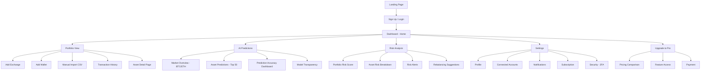
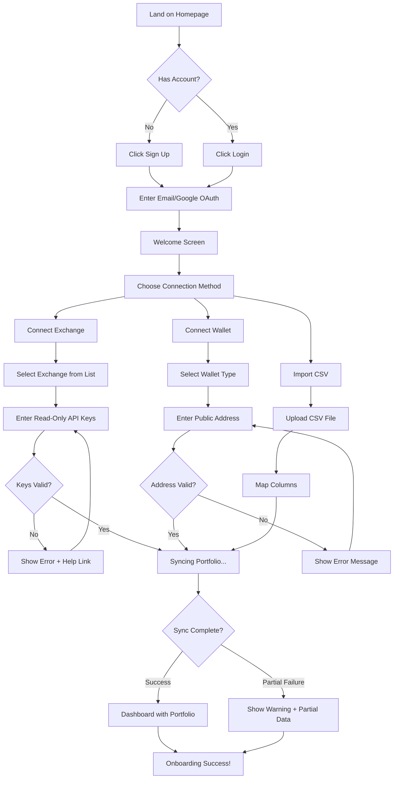
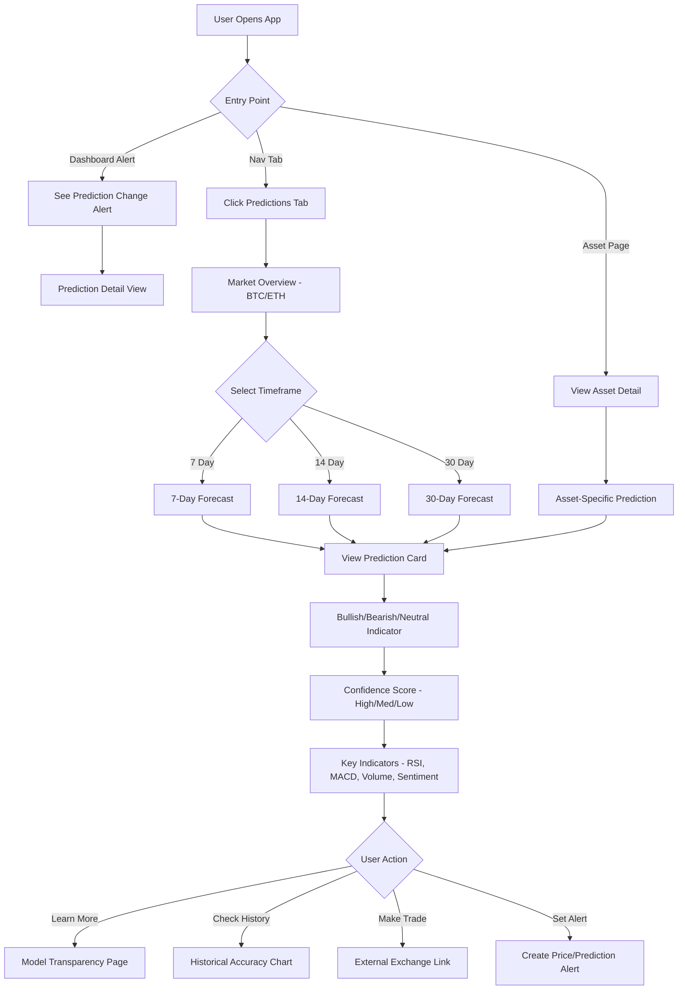
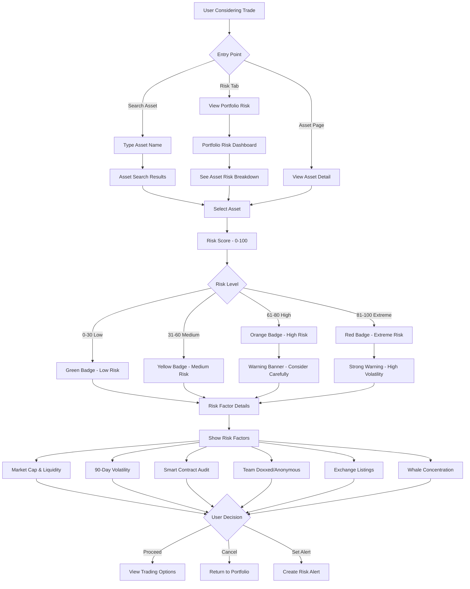

# Coinsphere UI/UX Specification

**Document Version**: 1.0 (Draft)
**Date**: October 6, 2025
**Status**: IN PROGRESS

---

## 1. Introduction

This document defines the user experience goals, information architecture, user flows, and visual design specifications for Coinsphere's user interface. It serves as the foundation for visual design and frontend development, ensuring a cohesive and user-centered experience.

---

## 2. Overall UX Goals & Principles

### 2.1 Target User Personas

**Persona 1: Active Crypto Trader "Alex"**
- Age 25-45, trades 10+ times per month
- Tech-savvy, uses multiple exchanges
- Pain: Can't predict when to enter/exit positions, gets rekt by volatile altcoins
- Goal: Make data-driven trading decisions with AI-powered predictions
- Willingness to Pay: $10-20/month for accurate predictions

**Persona 2: Crypto Native "Degen Dave"**
- High-risk tolerance, DeFi user, NFT trader
- Always looking for the next 100x opportunity
- Pain: Needs quick risk assessment before aping into new tokens
- Goal: Balance portfolio risk while maximizing upside potential
- Willingness to Pay: $15-30/month for edge

**Persona 3: Crypto-Curious "Cautious Carol"**
- New to crypto, risk-averse, wants guidance
- Overwhelmed by volatility and complex terminology
- Pain: Doesn't know when to buy/sell, fears losing money
- Goal: Understand portfolio health with simple, clear guidance
- Willingness to Pay: $5-10/month initially

---

### 2.2 Usability Goals

1. **Ease of learning:** New users can connect their first exchange and view portfolio within 5 minutes
2. **Efficiency of use:** Active traders can check AI predictions and risk scores in under 30 seconds
3. **Error prevention:** Clear warnings before connecting exchanges (read-only keys only), risk alerts for high-volatility assets
4. **Memorability:** Infrequent users can return after weeks and immediately understand their portfolio status
5. **Trust & transparency:** Every AI prediction shows "why" with key indicators (RSI, MACD, sentiment)

---

### 2.3 Design Principles

1. **Clarity over cleverness** - Prioritize clear communication over aesthetic innovation. Crypto data is complex; UI should simplify, not complicate.

2. **Progressive disclosure** - Show only what's needed, when it's needed. Free users see basic tracking; paid users unlock AI predictions layer-by-layer.

3. **Trust through transparency** - Every prediction shows its accuracy history and reasoning. No black-box AI.

4. **Speed & responsiveness** - Crypto moves fast. Dashboard loads in <3 seconds, price updates every 30-60 seconds.

5. **Accessible by default** - Design for all users from the start. High contrast for readability, keyboard navigation, screen reader support.

---

### 2.4 Change Log

| Date | Version | Description | Author |
|------|---------|-------------|--------|
| 2025-10-06 | 1.0 | Initial draft - UX goals and principles | Sally (UX Expert) |

---

## 3. Information Architecture (IA)

### 3.1 Site Map / Screen Inventory



---

### 3.2 Navigation Structure

**Top Bar Elements:** (Desktop & Mobile)
- **Logo** (left) - Brand identity, home link
- **Search** (center) - Quick asset lookup
- **Notification Bell** (right) - Alerts summary with badge count
- **User Avatar** (right) - Settings dropdown

**Primary Navigation:** (Bottom tab bar on mobile / Side nav on desktop)
- **Dashboard** (Home icon) - Default landing page, portfolio overview
- **Predictions** (Crystal ball icon) - AI market predictions (locked for free users with upgrade prompt)
- **Risk** (Shield icon) - Risk scoring and analysis (locked for free users)
- **Settings** (Gear icon) - Account, preferences, subscription

**Secondary Navigation:** (Contextual, within sections)
- Within Dashboard: Quick actions (Add Exchange, Add Wallet, Import CSV)
- Within Predictions: Timeframe selector (7d, 14d, 30d), Asset filter
- Within Risk: Risk level filter (Low, Medium, High, Extreme)

**Breadcrumb Strategy:**
- Minimal breadcrumbs for MVP (keep navigation simple)
- Only show on deep pages: `Dashboard > Asset Detail > BTC`
- Mobile: Use back button instead of breadcrumbs

---

### 3.3 Design Rationale (Five Whys Insight)

**Why 4 Primary Nav Items?**

The 4-nav structure (Dashboard, Predictions, Risk, Settings) protects our **core differentiation**:
- Every additional nav item dilutes focus from our key features (Predictions, Risk)
- Users must access predictions in <30 seconds or we lose our competitive advantage
- Crypto traders make high-stakes decisions under time pressure - UI must reduce cognitive load

**Alert Discoverability Solution:**
- Initially considered a 5th "Alerts" tab but rejected to avoid nav clutter
- **Compromise:** Notification bell icon in top bar provides:
  - Real-time badge count
  - Quick preview of latest alerts
  - Deep links to relevant sections (Dashboard, Predictions, Risk)
- Preserves 4-nav simplicity while making alerts discoverable
- Alerts are a premium feature - top bar placement ensures visibility without requiring full nav slot

---

## 4. User Flows

### 4.1 Flow: Onboarding & First Portfolio Connection

**User Goal:** New user wants to see their portfolio value within 5 minutes

**Entry Points:** Landing page CTA, Sign up button

**Success Criteria:** User views their complete portfolio with accurate balances

#### Flow Diagram



#### Edge Cases & Error Handling

- **Invalid API keys:** Show clear error message with link to exchange API documentation
- **Rate limited by exchange:** Display "Too many attempts, please wait 5 minutes" with countdown timer
- **No transactions found:** Show "Portfolio empty - add more exchanges or wallets"
- **Sync timeout:** Partial data shown with "Still syncing..." indicator and refresh button
- **Multiple portfolios:** Allow naming first portfolio (e.g., "Main Portfolio")

#### Notes

- **Critical timing:** Must complete in <5 minutes for "Ease of learning" goal
- **Trust signals:** Show "Read-only keys - we never ask for withdrawal permissions" warning
- **Progressive disclosure:** Advanced options (multiple exchanges, CSV mapping) hidden behind "Show more"
- **Exit option:** "Skip for now" button to let users explore demo portfolio first

---

### 4.2 Flow: Checking AI Predictions

**User Goal:** Active trader wants to check bull/bear predictions before making trade

**Entry Points:** Dashboard notification, Predictions nav tab, Asset detail page

**Success Criteria:** User views prediction with reasoning in <30 seconds

#### Flow Diagram



#### Edge Cases & Error Handling

- **Free user accessing predictions:** Show paywall overlay with "Upgrade to Plus" CTA
- **Prediction unavailable:** Display "Not enough data for this asset" with explanation
- **Low confidence prediction:** Yellow warning banner "Low confidence - use with caution"
- **Model retraining in progress:** Show "Predictions updating..." with last update timestamp
- **Conflicting signals:** Show "Mixed signals detected" with explanation of key indicator conflicts

#### Notes

- **Speed is critical:** Dashboard to prediction should be 2 taps (mobile) or 1 click (desktop)
- **Transparency emphasis:** Always show "Why this prediction?" section with key indicators
- **Trust building:** Display historical accuracy prominently (e.g., "72% accurate over last 30 days")
- **Conversion hook:** Free users see blurred predictions with upgrade prompt

---

### 4.3 Flow: Risk Assessment Before Trade

**User Goal:** Trader evaluating whether to buy a high-volatility altcoin

**Entry Points:** Risk nav tab, Asset detail page, Search result

**Success Criteria:** User sees risk score and decides whether to proceed with trade

#### Flow Diagram



#### Edge Cases & Error Handling

- **Risk data incomplete:** Show "Limited data available" with partial risk score
- **Newly listed asset:** Display "New listing - insufficient data for risk scoring"
- **Risk score changes dramatically:** Alert user if score jumps >20 points in 24 hours
- **Portfolio risk too high:** Warning message "Your portfolio risk is 75/100 - consider rebalancing"
- **Free user accessing risk scores:** Paywall after viewing top 10 holdings

#### Notes

- **Visual hierarchy:** Risk score is the largest element (immediate decision support)
- **Color psychology:** Red for extreme risk aligns with crypto community conventions
- **Educational opportunity:** First-time users get tooltip explaining each risk factor
- **Conversion strategy:** Free users see risk scores for top 10 holdings, upgrade for full portfolio

---

## 5. Wireframes & Mockups

### 5.1 Design Files

**Primary Design Tool:** Figma (recommended for web + mobile design system)

**Design File Structure:**
```
Coinsphere Design System/
├── 📱 Mobile Screens/
│   ├── Onboarding Flow
│   ├── Dashboard
│   ├── Predictions
│   ├── Risk Analysis
│   └── Settings
├── 💻 Desktop Screens/
│   └── (Same structure as mobile)
├── 🧩 Components Library/
│   ├── Navigation
│   ├── Cards
│   ├── Forms
│   └── Data Visualization
└── 🎨 Design Tokens/
    ├── Colors
    ├── Typography
    └── Spacing
```

**Figma Link:** [To be created - placeholder for design files]

---

### 5.2 Key Screen Layouts

#### Screen 1: Dashboard (Home)

**Purpose:** Primary landing page showing portfolio overview and quick access to key features

**Key Elements:**
- **Top Bar:** Logo, search bar, notification bell (with badge), user avatar
- **Portfolio Value Card:**
  - Total portfolio value (large, prominent)
  - 24h/7d/30d percentage change (color-coded: green=positive, red=negative)
  - Sparkline chart showing trend
- **Quick Actions Bar:**
  - Add Exchange button
  - Add Wallet button
  - Import CSV button
- **Asset Allocation:**
  - Pie/donut chart showing top assets
  - Legend with percentages
- **Top 10 Holdings Table:**
  - Asset name + icon
  - Current price
  - 24h change %
  - Holdings value
  - Risk score badge (Pro users only)
- **Recent Transactions (Last 20):**
  - Transaction type (Buy/Sell/Transfer)
  - Asset
  - Amount
  - Date/time
- **Upgrade Banner (Free Users):**
  - "Unlock AI Predictions" CTA with blurred preview
- **Bottom Navigation (Mobile):** Dashboard, Predictions, Risk, Settings

**Interaction Notes:**
- Tap portfolio value card to see detailed breakdown
- Tap asset in holdings table to view asset detail page
- Pull to refresh updates prices in real-time
- Swipe left on transaction for details

**Design File Reference:** `Figma > Mobile Screens > Dashboard`

---

#### Screen 2: AI Predictions - Market Overview

**Purpose:** Show bull/bear predictions for BTC/ETH with transparency and confidence scores

**Key Elements:**
- **Top Bar:** Back button, "Predictions" title, filter icon, share icon
- **Timeframe Selector (Tabs):**
  - 7 Day (default)
  - 14 Day
  - 30 Day
- **BTC Prediction Card:**
  - Large bull/bear icon (up arrow = bullish, down arrow = bearish)
  - Price prediction range
  - Confidence score with color indicator (High=green, Med=yellow, Low=orange)
  - "Why this prediction?" expandable section showing:
    - RSI: 65 (Overbought)
    - MACD: Bullish crossover
    - Volume: +35% above average
    - Social Sentiment: +8% positive
  - Historical accuracy: "72% accurate over last 30 days" (small text)
- **ETH Prediction Card:** (Same structure as BTC)
- **Top 50 Assets Button:** "View predictions for 50+ cryptocurrencies" (Pro feature)
- **Model Transparency Link:** "How our AI works" → leads to explainer page
- **Paywall Overlay (Free Users):**
  - Blurred content with "Upgrade to Plus for AI predictions" CTA

**Interaction Notes:**
- Tap confidence score to see detailed breakdown
- Tap "Why this prediction?" to expand/collapse indicators
- Tap accuracy percentage to view historical chart
- Swipe between BTC/ETH cards

**Design File Reference:** `Figma > Mobile Screens > Predictions > Market Overview`

---

#### Screen 3: Risk Analysis - Portfolio Risk Dashboard

**Purpose:** Show overall portfolio risk and breakdown by asset

**Key Elements:**
- **Top Bar:** Back button, "Risk Analysis" title, filter icon
- **Portfolio Risk Score (Hero Section):**
  - Large circular gauge showing 0-100 score
  - Color-coded zones (green 0-30, yellow 31-60, orange 61-80, red 81-100)
  - Risk level label: "Medium Risk"
  - Subtitle: "Your portfolio has moderate volatility"
- **Risk Distribution Chart:**
  - Horizontal bar chart showing % of portfolio in each risk category
  - Low Risk: 35% (green)
  - Medium Risk: 45% (yellow)
  - High Risk: 15% (orange)
  - Extreme Risk: 5% (red)
- **Highest Risk Holdings (Top 5):**
  - Asset name + icon
  - Risk score badge (color-coded)
  - Holdings value
  - Risk factors summary (e.g., "High volatility, Low liquidity")
- **Rebalancing Suggestions Card:**
  - "Consider reducing exposure to high-risk assets"
  - Suggested actions (e.g., "Take profit on DOGE, add more BTC")
- **Alert Settings Button:** "Get alerts when risk changes"
- **Paywall (Free Users):**
  - Show top 10 holdings only, rest blurred with "Upgrade to Pro" CTA

**Interaction Notes:**
- Tap risk score gauge to see detailed factors
- Tap asset to view full risk breakdown
- Tap rebalancing suggestion to see detailed plan

**Design File Reference:** `Figma > Mobile Screens > Risk Analysis > Portfolio Dashboard`

---

#### Screen 4: Asset Detail Page

**Purpose:** Deep dive into single asset with price, predictions, risk score, and holdings

**Key Elements:**
- **Top Bar:** Back button, asset name (e.g., "Bitcoin"), star icon (watchlist), share icon
- **Asset Header:**
  - Asset icon + symbol (BTC)
  - Current price (large, prominent)
  - 24h change % (color-coded)
- **Price Chart:**
  - Line/candlestick chart
  - Timeframe selector: 1H, 24H, 7D, 30D, 1Y, ALL
  - Touch to view price at specific time
- **Tab Navigation:**
  - Overview (default)
  - Prediction (Pro)
  - Risk Score (Pro)
  - Holdings
- **Overview Tab:**
  - Market cap
  - 24h volume
  - Circulating supply
  - All-time high/low
- **Prediction Tab (Pro):**
  - Same structure as Market Overview prediction cards
  - Asset-specific indicators
- **Risk Score Tab (Pro):**
  - Risk gauge + detailed factors
  - Historical risk chart
- **Holdings Tab:**
  - Your holdings value
  - Average buy price
  - P&L (profit/loss)
  - Transaction history for this asset
- **Action Buttons:**
  - Set Price Alert
  - Trade on Exchange (external link)

**Interaction Notes:**
- Pinch to zoom on price chart
- Swipe between tabs
- Tap "Trade on Exchange" opens deep link to user's preferred exchange

**Design File Reference:** `Figma > Mobile Screens > Asset Detail`

---

#### Screen 5: Onboarding - Connect Exchange

**Purpose:** Guide user through connecting first exchange with clear instructions

**Key Elements:**
- **Progress Indicator:** Step 2 of 3
- **Header:** "Connect Your Exchange"
- **Subheader:** "We'll sync your portfolio automatically (read-only, secure)"
- **Exchange List (Searchable):**
  - Exchange logos in grid or list
  - Top 20 exchanges: Binance, Coinbase, Kraken, etc.
  - Search bar at top
- **Selected Exchange Screen:**
  - Exchange logo + name
  - "What you'll need:" section
    - API Key
    - Secret Key
    - Read-only permissions
  - "How to get API keys" expandable help section with step-by-step guide
  - Input fields for API key and Secret key
  - Toggle: "Enable read-only permissions" (checked, disabled)
  - Security notice: "🔒 We never ask for withdrawal permissions"
- **Action Buttons:**
  - "Connect Exchange" (primary, prominent)
  - "Skip for now" (secondary, less prominent)

**Interaction Notes:**
- Tap exchange logo to select
- Tap help section expands with screenshots/video
- Show loading spinner during connection validation
- Success state shows checkmark + "Connected successfully"

**Design File Reference:** `Figma > Mobile Screens > Onboarding > Connect Exchange`

---

#### Screen 6: Settings - Subscription Management

**Purpose:** Allow users to view current plan and upgrade/downgrade

**Key Elements:**
- **Top Bar:** Back button, "Subscription" title
- **Current Plan Card:**
  - Plan name: "Free Plan" or "Plus" or "Pro"
  - Monthly cost
  - Features list (checkmarks)
  - "Upgrade" or "Manage Plan" button
- **Pricing Comparison Table:**
  - Side-by-side comparison of Free, Plus, Pro, Power Trader
  - Feature rows with checkmarks/X marks
  - Highlight recommended plan (Pro)
- **Billing Info (Paid Users):**
  - Next billing date
  - Payment method (card ending in XXXX)
  - "Update payment method" link
  - "Cancel subscription" link (secondary, small)
- **Usage Stats:**
  - API calls used this month: 850 / 1,000
  - Portfolios: 5 / 5
  - Alerts: 3 / 10

**Interaction Notes:**
- Tap "Upgrade" opens payment flow
- Tap feature comparison row to see detailed explanation
- Drag to scroll horizontally through pricing tiers

**Design File Reference:** `Figma > Mobile Screens > Settings > Subscription`

---

## 6. Component Library / Design System

### 6.1 Design System Approach

**Strategy:** Build custom component library using Shadcn/ui as foundation

**Rationale:**
- Shadcn/ui provides accessible, customizable React components
- Tailwind CSS for rapid styling and consistency
- Copy-paste components (not npm dependency) for full control
- Built-in dark mode support (critical for crypto apps)

**Component Documentation:** Living style guide in Storybook (to be created)

---

### 6.2 Core Components

#### Component: Button

**Purpose:** Primary action triggers throughout the application

**Variants:**
- **Primary:** Solid background, high contrast (main CTAs)
- **Secondary:** Outlined, less prominent (secondary actions)
- **Ghost:** No background, minimal (tertiary actions)
- **Danger:** Red color scheme (destructive actions like "Delete")

**States:**
- Default
- Hover (scale 1.02, shadow increase)
- Active/Pressed (scale 0.98)
- Disabled (opacity 0.5, cursor not-allowed)
- Loading (spinner icon, disabled state)

**Sizes:**
- Small (32px height, 12px padding)
- Medium (40px height, 16px padding) - default
- Large (48px height, 20px padding)

**Usage Guidelines:**
- Use Primary for main actions per screen (max 1-2)
- Secondary for supporting actions
- Ghost for inline actions in tables/lists
- Always include loading state for async actions

---

#### Component: Card

**Purpose:** Container for grouped information and actions

**Variants:**
- **Default:** White background (light mode), dark gray (dark mode), subtle shadow
- **Elevated:** Larger shadow, stands out from background
- **Outlined:** Border instead of shadow, minimal
- **Interactive:** Hover state with cursor pointer (clickable cards)

**States:**
- Default
- Hover (shadow increase, subtle scale on interactive cards)
- Selected (border highlight, different background)
- Disabled (opacity 0.6)

**Common Patterns:**
- Portfolio Value Card (Dashboard)
- Prediction Card (AI Predictions)
- Risk Score Card (Risk Analysis)
- Asset Card (Holdings list)

**Usage Guidelines:**
- Use for logical grouping of related information
- Include clear header/title when appropriate
- Maintain consistent padding (16px mobile, 24px desktop)

---

#### Component: Data Table

**Purpose:** Display structured data with sorting, filtering, and actions

**Variants:**
- **Simple:** Basic rows with columns
- **Expandable:** Row expands to show details
- **Selectable:** Checkboxes for bulk actions
- **Striped:** Alternating row backgrounds

**States:**
- Default
- Hover (row highlight)
- Selected (checkbox checked, row highlighted)
- Loading (skeleton rows)
- Empty (empty state illustration)

**Features:**
- Column sorting (ascending/descending)
- Column resizing (desktop)
- Sticky header on scroll
- Pagination or infinite scroll
- Mobile: Card view instead of table

**Usage Guidelines:**
- Use for holdings table, transaction history
- Max 5-7 columns on mobile
- Show most important columns first
- Provide export functionality for large datasets

---

#### Component: Chart / Data Visualization

**Purpose:** Display financial data trends and comparisons

**Library:** Recharts (React wrapper for D3)

**Variants:**
- **Line Chart:** Price history, portfolio value over time
- **Candlestick Chart:** Asset price with OHLC data
- **Pie/Donut Chart:** Asset allocation
- **Bar Chart:** Risk distribution, comparison data
- **Sparkline:** Inline mini-chart showing trends

**States:**
- Loading (skeleton placeholder)
- No data (empty state message)
- Tooltip on hover (show exact values)

**Usage Guidelines:**
- Use consistent color palette across all charts
- Show loading state immediately (don't wait for data)
- Provide zoom/pan for time-series charts
- Mobile: Simplify charts, reduce data points if needed

---

#### Component: Badge

**Purpose:** Status indicators, labels, and metadata tags

**Variants:**
- **Risk Level:** Color-coded (green=low, yellow=medium, orange=high, red=extreme)
- **Confidence Score:** Color-coded (green=high, yellow=medium, orange=low)
- **Price Change:** Green (positive %), Red (negative %)
- **Plan Tier:** Blue (Plus), Purple (Pro), Gold (Power Trader)
- **Status:** Gray (neutral), Blue (info), Green (success), Red (error)

**Sizes:**
- Small (pill-shaped, compact)
- Medium (default)
- Large (prominent labels)

**Usage Guidelines:**
- Use sparingly to avoid visual clutter
- Color should reinforce meaning, not be decorative
- Include icon when helpful (✓ for success, ⚠ for warning)

---

#### Component: Alert / Notification

**Purpose:** System messages, feedback, and important information

**Variants:**
- **Info:** Blue background, informational messages
- **Success:** Green background, confirmation messages
- **Warning:** Yellow/orange background, caution messages
- **Error:** Red background, error messages
- **Toast:** Temporary notification (auto-dismiss after 5s)

**States:**
- Default
- Dismissible (X button in corner)
- Actionable (includes CTA button)

**Placement:**
- **Inline alerts:** Within content area (form validation errors)
- **Banner alerts:** Top of screen (system-wide messages)
- **Toast notifications:** Bottom-right corner (temporary feedback)

**Usage Guidelines:**
- Use appropriate severity level
- Provide clear action steps in error messages
- Auto-dismiss success toasts after 5 seconds
- Keep messages concise (1-2 sentences max)

---

#### Component: Modal / Dialog

**Purpose:** Focused interactions and confirmations

**Variants:**
- **Default Modal:** Centered, overlay background
- **Drawer:** Slides from bottom (mobile) or side (desktop)
- **Confirmation Dialog:** Simple yes/no choice
- **Full Screen Modal:** Complex multi-step flows

**States:**
- Entering (fade + scale animation)
- Open
- Exiting (reverse animation)

**Features:**
- Click overlay to close (optional)
- ESC key to close
- Focus trap (keyboard navigation stays in modal)
- Scroll lock on body

**Usage Guidelines:**
- Use sparingly (modals interrupt flow)
- Always provide clear way to close
- Use for confirmations, forms, detailed views
- Mobile: Prefer drawers over centered modals

---

## 7. Branding & Style Guide

### 7.1 Visual Identity

**Brand Guidelines:** [To be created - link to brand guide document]

**Brand Personality:**
- Professional yet approachable
- Data-driven and transparent
- Modern and tech-forward
- Trustworthy and secure

**Visual Style:**
- Clean, minimal interface
- Bold data visualization
- High contrast for readability
- Crypto-native aesthetic (dark mode default)

---

### 7.2 Color Palette

| Color Type | Hex Code | Usage |
|------------|----------|-------|
| **Primary** | `#3B82F6` | Main brand color, primary buttons, links |
| **Primary Dark** | `#2563EB` | Hover states, dark mode accent |
| **Secondary** | `#8B5CF6` | Secondary actions, Pro tier branding |
| **Accent** | `#10B981` | Success states, positive price changes |
| **Success** | `#22C55E` | Confirmations, low risk indicators |
| **Warning** | `#F59E0B` | Cautions, medium risk indicators |
| **Error** | `#EF4444` | Errors, high risk indicators, negative price changes |
| **Neutral Gray 50** | `#F9FAFB` | Light backgrounds |
| **Neutral Gray 100** | `#F3F4F6` | Subtle backgrounds, borders |
| **Neutral Gray 500** | `#6B7280` | Secondary text, placeholders |
| **Neutral Gray 900** | `#111827` | Primary text, headings |
| **Dark Background** | `#0F172A` | Dark mode primary background |
| **Dark Surface** | `#1E293B` | Dark mode card backgrounds |

**Color Usage Guidelines:**
- Use Primary for main CTAs and interactive elements
- Green for positive values, red for negative (universal convention)
- Risk scores: Green (0-30), Yellow (31-60), Orange (61-80), Red (81-100)
- Maintain 4.5:1 contrast ratio for text (WCAG AA compliance)

---

### 7.3 Typography

#### Font Families

- **Primary:** Inter (Google Fonts) - UI text, body copy
- **Secondary:** Manrope (Google Fonts) - Headings, emphasis
- **Monospace:** JetBrains Mono - Numerical data, API keys, code

**Rationale:**
- Inter: Excellent readability at small sizes, optimized for screens
- Manrope: Modern geometric sans-serif, pairs well with Inter
- JetBrains Mono: Clear distinction between similar characters (0 vs O, 1 vs l)

#### Type Scale

| Element | Size | Weight | Line Height | Usage |
|---------|------|--------|-------------|-------|
| **H1** | 36px / 2.25rem | 700 Bold | 1.2 | Page titles |
| **H2** | 28px / 1.75rem | 600 SemiBold | 1.3 | Section headings |
| **H3** | 22px / 1.375rem | 600 SemiBold | 1.4 | Subsection headings |
| **H4** | 18px / 1.125rem | 600 SemiBold | 1.5 | Card titles |
| **Body Large** | 18px / 1.125rem | 400 Regular | 1.6 | Important body text |
| **Body** | 16px / 1rem | 400 Regular | 1.6 | Default body text |
| **Body Small** | 14px / 0.875rem | 400 Regular | 1.5 | Secondary info, captions |
| **Label** | 12px / 0.75rem | 500 Medium | 1.4 | Form labels, metadata |
| **Data Large** | 32px / 2rem | 700 Bold | 1.2 | Portfolio value, prices |
| **Data** | 20px / 1.25rem | 600 SemiBold | 1.3 | Table values, metrics |

**Typography Guidelines:**
- Use monospace font for all numerical financial data (consistency)
- Limit to 3 font weights (400, 600, 700) to reduce load time
- Mobile: Reduce font sizes by 10-15% for better fit

---

### 7.4 Iconography

**Icon Library:** Lucide Icons (React)

**Rationale:**
- Consistent design language with Shadcn/ui
- 1000+ icons, covers all use cases
- Customizable size and color
- Optimized SVGs, small bundle size

**Common Icons:**
- Home (Dashboard)
- TrendingUp (Predictions)
- Shield (Risk)
- Settings (Settings)
- Bell (Notifications)
- Search (Search)
- Plus (Add)
- ArrowUp/ArrowDown (Price changes, sort)
- AlertTriangle (Warnings)
- CheckCircle (Success)
- XCircle (Errors)

**Usage Guidelines:**
- Use 16px icons for inline text
- Use 20px icons for buttons
- Use 24px icons for navigation
- Always include accessible label (aria-label or sr-only text)
- Maintain consistent stroke width (2px)

---

### 7.5 Spacing & Layout

**Grid System:** 12-column grid (desktop), 4-column grid (mobile)

**Container Widths:**
- Mobile: 100% (16px padding left/right)
- Tablet: 768px max
- Desktop: 1200px max
- Wide: 1400px max

**Spacing Scale (Tailwind):**
```
0    = 0px
1    = 4px
2    = 8px
3    = 12px
4    = 16px   ← Base unit
5    = 20px
6    = 24px
8    = 32px
10   = 40px
12   = 48px
16   = 64px
20   = 80px
```

**Spacing Guidelines:**
- Card padding: 16px (mobile), 24px (desktop)
- Section spacing: 32px (mobile), 48px (desktop)
- Component spacing: 8px (tight), 16px (normal), 24px (loose)
- Button padding: 12px horizontal, 8px vertical (medium size)

---

## 8. Accessibility Requirements

### 8.1 Compliance Target

**Standard:** WCAG 2.1 Level AA

**Rationale:**
- Level AA is industry standard for web applications
- Covers most common accessibility needs
- Legally required in many jurisdictions
- Demonstrates commitment to inclusive design

---

### 8.2 Key Requirements

**Visual:**
- **Color contrast ratios:** 4.5:1 for normal text, 3:1 for large text (18px+)
- **Focus indicators:** 2px solid outline on all interactive elements
- **Text sizing:** Support browser zoom up to 200% without breaking layout
- **No color-only indicators:** Always pair color with icon or text label

**Interaction:**
- **Keyboard navigation:** All features accessible via keyboard (Tab, Enter, Arrow keys)
- **Screen reader support:** Semantic HTML, ARIA labels, roles, and live regions
- **Touch targets:** Minimum 44x44px for all interactive elements (mobile)
- **No keyboard traps:** User can always navigate away from modals/dropdowns

**Content:**
- **Alternative text:** All images, icons, and charts have descriptive alt text
- **Heading structure:** Logical heading hierarchy (H1 → H2 → H3, no skipping)
- **Form labels:** All form inputs have visible labels or aria-label

---

### 8.3 Testing Strategy

**Automated Testing:**
- Run axe DevTools on all pages (catch 30-40% of issues)
- Lighthouse accessibility score 90+ target
- ESLint jsx-a11y plugin for React components

**Manual Testing:**
- Keyboard-only navigation testing
- Screen reader testing (NVDA on Windows, VoiceOver on iOS)
- Color blindness simulation (Protanopia, Deuteranopia, Tritanopia)
- Zoom testing (200% browser zoom)

**User Testing:**
- Test with users with disabilities (screen reader users, low vision users)
- Collect feedback on accessibility pain points
- Iterate based on real-world usage

---

## 9. Responsiveness Strategy

### 9.1 Breakpoints

| Breakpoint | Min Width | Max Width | Target Devices |
|------------|-----------|-----------|----------------|
| **Mobile** | 320px | 767px | iPhone SE to iPhone 14 Pro Max, Android phones |
| **Tablet** | 768px | 1023px | iPad, Android tablets |
| **Desktop** | 1024px | 1439px | Laptops, small monitors |
| **Wide** | 1440px | - | Large monitors, 4K displays |

---

### 9.2 Adaptation Patterns

**Layout Changes:**
- **Mobile:** Single column, stacked content, bottom tab navigation
- **Tablet:** 2-column grid where appropriate, side navigation appears
- **Desktop:** 3-column layouts, more whitespace, larger charts
- **Wide:** Max content width to avoid ultra-wide layouts

**Navigation Changes:**
- **Mobile:** Bottom tab bar (4 primary nav items), hamburger menu for secondary nav
- **Tablet:** Side navigation drawer (collapsible)
- **Desktop:** Persistent side navigation + top bar

**Content Priority:**
- **Mobile:** Show essential data first, hide advanced features behind "Show more"
- **Tablet:** Display more information density
- **Desktop:** Show all features, multi-column layouts

**Interaction Changes:**
- **Mobile:** Touch-optimized (44px touch targets), swipe gestures, pull-to-refresh
- **Tablet:** Hybrid touch + pointer support
- **Desktop:** Hover states, keyboard shortcuts, right-click context menus

---

## 10. Animation & Micro-interactions

### 10.1 Motion Principles

**Guiding Principles:**
1. **Purpose-driven:** Animations provide feedback or guide attention (not decorative)
2. **Fast and subtle:** Crypto data changes rapidly, UI shouldn't slow users down
3. **Consistent timing:** Use standard durations (150ms, 300ms) throughout
4. **Respect preferences:** Honor prefers-reduced-motion setting

**When to animate:**
- ✅ Loading states (skeleton screens, spinners)
- ✅ State changes (success/error feedback)
- ✅ Page transitions (fade, slide)
- ✅ Data updates (number counting, chart transitions)
- ❌ Decorative animations
- ❌ Looping animations (except loading indicators)

---

### 10.2 Key Animations

- **Button press:** Scale 0.98, 100ms, ease-in-out
- **Card hover:** Scale 1.02 + shadow increase, 150ms, ease-out
- **Modal enter:** Fade + scale from 0.95, 200ms, ease-out
- **Modal exit:** Fade + scale to 0.95, 150ms, ease-in
- **Toast notification:** Slide from right + fade, 300ms, ease-out
- **Number counter:** Count up animation on portfolio value change, 500ms, ease-out
- **Skeleton loading:** Shimmer effect, 1500ms loop, linear
- **Chart data update:** Smooth transition between data points, 300ms, ease-in-out

---

## 11. Performance Considerations

### 11.1 Performance Goals

- **Page Load:** First Contentful Paint <1.5s, Time to Interactive <3s
- **Interaction Response:** UI responds to user input within 100ms
- **Animation FPS:** Maintain 60fps for all animations
- **Bundle Size:** Initial JS bundle <200KB gzipped

---

### 11.2 Design Strategies

**Image Optimization:**
- Use WebP format for images (fallback to PNG)
- Lazy load images below the fold
- Use appropriate image sizes (don't load 2x images on mobile)
- Asset icons: Use SVG sprites instead of individual files

**Data Fetching:**
- Show skeleton screens immediately (perceived performance)
- Stale-while-revalidate strategy (show cached data, update in background)
- Prefetch likely next screens (Asset Detail when viewing Holdings)
- Real-time updates via WebSocket (more efficient than polling)

**Code Splitting:**
- Route-based code splitting (Dashboard, Predictions, Risk as separate bundles)
- Lazy load heavy components (Charts, Modals)
- Tree-shake unused Lucide icons

**Rendering Optimization:**
- Virtualize long lists (Transaction History with 1000+ items)
- Debounce search inputs (300ms delay)
- Memoize expensive computations (portfolio calculations)
- Use React.memo for components that re-render frequently

---

## 12. Next Steps

### 12.1 Immediate Actions

1. **Create Figma design files** based on wireframes and component specifications
2. **Build design system** in Storybook with Shadcn/ui + Tailwind
3. **Design handoff meeting** with development team to review specifications
4. **User testing session** with 5-10 target users (validate key flows and UI patterns)
5. **Accessibility audit** of initial designs before development begins

---

### 12.2 Design Handoff Checklist

- [x] All user flows documented
- [x] Component inventory complete
- [x] Accessibility requirements defined
- [x] Responsive strategy clear
- [x] Brand guidelines incorporated
- [x] Performance goals established
- [ ] Figma files created with high-fidelity mockups
- [ ] Interactive prototype built for user testing
- [ ] Design tokens exported for development
- [ ] Component documentation in Storybook
- [ ] Accessibility testing completed
- [ ] Handoff meeting with developers scheduled

---

**Document Complete!** 🎉

This UI/UX Specification provides the foundation for visual design and frontend development of Coinsphere.

**Next Review Date:** After MVP launch (Week 12)

---

**END OF DOCUMENT**
