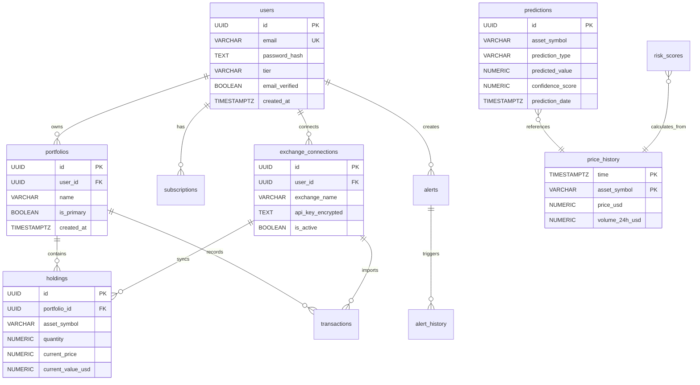

# Database Schema Specification - CryptoSense Analytics Platform

**Document Version**: 1.0
**Date**: October 7, 2025
**Status**: Ready for Implementation
**Database**: PostgreSQL 15 + TimescaleDB Extension

---

## Table of Contents

1. [Overview](#overview)
2. [Database Architecture](#database-architecture)
3. [Schema Design Principles](#schema-design-principles)
4. [Core Tables](#core-tables)
5. [Time-Series Tables (TimescaleDB)](#time-series-tables-timescaledb)
6. [Indexes & Performance](#indexes--performance)
7. [Entity Relationship Diagram](#entity-relationship-diagram)
8. [Migration Strategy](#migration-strategy)
9. [Seed Data](#seed-data)
10. [Backup & Recovery](#backup--recovery)

---

## 1. Overview

### 1.1 Database Stack

**Primary Database**: PostgreSQL 15
- ACID compliance for financial data
- JSON support for flexible schemas
- Full-text search for asset lookup
- Proven reliability at scale

**Time-Series Extension**: TimescaleDB
- Optimized for crypto price data
- Automatic partitioning by time
- Compression for historical data
- 10x faster queries on time-series data

**Cache Layer**: Redis 7
- Session storage
- Real-time price cache
- Job queues (Bull/Celery)

### 1.2 Data Categories

| Category | Storage | Retention | Why |
|----------|---------|-----------|-----|
| **User Data** | PostgreSQL | Permanent (until deletion) | ACID, relational integrity |
| **Portfolio Holdings** | PostgreSQL | Permanent | Transactional consistency |
| **Price Data** | TimescaleDB | 5 years | Time-series optimized |
| **Predictions** | PostgreSQL + TimescaleDB | 2 years | Hybrid (metadata + time-series) |
| **Session Data** | Redis | 7 days | Fast access, ephemeral |
| **Real-Time Prices** | Redis | 30 seconds | Ultra-low latency |

---

## 2. Database Architecture

### 2.1 Connection Topology

```
┌─────────────────────────────────────────────────────┐
│                  Application Layer                   │
│                                                      │
│  API Services (Node.js)    ML Service (Python)      │
│         │                          │                │
└─────────┼──────────────────────────┼────────────────┘
          │                          │
          ▼                          ▼
┌─────────────────────┐    ┌──────────────────────────┐
│  PostgreSQL Master  │◄───│  PostgreSQL Read Replica │
│  (Primary DB)       │    │  (Future: Month 9+)      │
│                     │    │                          │
│  - User accounts    │    │  - Read-only queries     │
│  - Portfolios       │    │  - Analytics queries     │
│  - Subscriptions    │    │  - Report generation     │
│  - Predictions      │    │                          │
│                     │    └──────────────────────────┘
│  TimescaleDB:       │
│  - Price history    │
│  - Market data      │
└─────────────────────┘

          │
          ▼
┌─────────────────────┐
│   Redis Cluster     │
│                     │
│  - Session cache    │
│  - Price cache      │
│  - Job queues       │
└─────────────────────┘
```

### 2.2 Connection Pooling

**Node.js (pg library)**:
```javascript
// config/database.js
const { Pool } = require('pg');

const pool = new Pool({
  host: process.env.DATABASE_HOST,
  port: 5432,
  database: process.env.DATABASE_NAME,
  user: process.env.DATABASE_USER,
  password: process.env.DATABASE_PASSWORD,
  max: 20,                 // Max connections in pool
  idleTimeoutMillis: 30000,
  connectionTimeoutMillis: 2000,
});
```

**Python (asyncpg for FastAPI)**:
```python
# config/database.py
import asyncpg
from typing import AsyncGenerator

async def get_db_pool():
    return await asyncpg.create_pool(
        host=os.getenv('DATABASE_HOST'),
        port=5432,
        database=os.getenv('DATABASE_NAME'),
        user=os.getenv('DATABASE_USER'),
        password=os.getenv('DATABASE_PASSWORD'),
        min_size=5,
        max_size=20,
        command_timeout=60
    )
```

---

## 3. Schema Design Principles

### 3.1 Naming Conventions

**Tables**: `snake_case`, plural nouns
- ✅ `users`, `portfolios`, `holdings`
- ❌ `User`, `Portfolio`, `Holding`

**Columns**: `snake_case`
- ✅ `created_at`, `user_id`, `encrypted_api_key`
- ❌ `createdAt`, `userId`, `EncryptedApiKey`

**Indexes**: `idx_{table}_{column(s)}`
- ✅ `idx_users_email`, `idx_portfolios_user_id`

**Foreign Keys**: `fk_{table}_{referenced_table}`
- ✅ `fk_portfolios_users`, `fk_holdings_portfolios`

### 3.2 Data Types Standards

| Data Type | PostgreSQL Type | Example Use Case |
|-----------|----------------|------------------|
| **Primary Keys** | `UUID` or `BIGSERIAL` | `id UUID PRIMARY KEY DEFAULT gen_random_uuid()` |
| **Foreign Keys** | Match referenced column | `user_id UUID REFERENCES users(id)` |
| **Timestamps** | `TIMESTAMPTZ` | `created_at TIMESTAMPTZ DEFAULT NOW()` |
| **Prices/Amounts** | `NUMERIC(20, 8)` | `price NUMERIC(20, 8)` (8 decimals for crypto) |
| **Percentages** | `NUMERIC(5, 2)` | `confidence NUMERIC(5, 2)` (0.00 - 100.00) |
| **Enums** | `VARCHAR` or `ENUM` | `tier VARCHAR(20) CHECK (tier IN ('free', 'plus', 'pro'))` |
| **JSON Data** | `JSONB` | `metadata JSONB` (indexed, queryable) |
| **Encrypted Data** | `TEXT` | `encrypted_api_key TEXT` |

### 3.3 Soft Deletes

Critical tables use soft deletes (retain data for recovery):

```sql
ALTER TABLE users ADD COLUMN deleted_at TIMESTAMPTZ;
CREATE INDEX idx_users_deleted_at ON users(deleted_at) WHERE deleted_at IS NULL;

-- Queries exclude soft-deleted records
SELECT * FROM users WHERE deleted_at IS NULL;
```

---

## 4. Core Tables

### 4.1 Users Table

Stores user account information.

```sql
CREATE TABLE users (
    id UUID PRIMARY KEY DEFAULT gen_random_uuid(),
    email VARCHAR(255) UNIQUE NOT NULL,
    password_hash TEXT NOT NULL,
    first_name VARCHAR(100),
    last_name VARCHAR(100),
    tier VARCHAR(20) DEFAULT 'free' CHECK (tier IN ('free', 'plus', 'pro', 'power-trader')),
    email_verified BOOLEAN DEFAULT FALSE,
    email_verification_token TEXT,
    password_reset_token TEXT,
    password_reset_expires TIMESTAMPTZ,
    two_factor_enabled BOOLEAN DEFAULT FALSE,
    two_factor_secret TEXT,
    country_code VARCHAR(2),
    timezone VARCHAR(50) DEFAULT 'UTC',
    language VARCHAR(5) DEFAULT 'en',
    created_at TIMESTAMPTZ DEFAULT NOW(),
    updated_at TIMESTAMPTZ DEFAULT NOW(),
    last_login_at TIMESTAMPTZ,
    deleted_at TIMESTAMPTZ,

    CONSTRAINT email_format CHECK (email ~* '^[A-Za-z0-9._%+-]+@[A-Za-z0-9.-]+\.[A-Za-z]{2,}$')
);

-- Indexes
CREATE INDEX idx_users_email ON users(email) WHERE deleted_at IS NULL;
CREATE INDEX idx_users_tier ON users(tier);
CREATE INDEX idx_users_created_at ON users(created_at);
CREATE INDEX idx_users_deleted_at ON users(deleted_at) WHERE deleted_at IS NULL;

-- Trigger for updated_at
CREATE OR REPLACE FUNCTION update_updated_at_column()
RETURNS TRIGGER AS $$
BEGIN
    NEW.updated_at = NOW();
    RETURN NEW;
END;
$$ LANGUAGE plpgsql;

CREATE TRIGGER update_users_updated_at BEFORE UPDATE ON users
FOR EACH ROW EXECUTE FUNCTION update_updated_at_column();
```

### 4.2 Subscriptions Table

Manages user subscription tiers and billing.

```sql
CREATE TABLE subscriptions (
    id UUID PRIMARY KEY DEFAULT gen_random_uuid(),
    user_id UUID NOT NULL REFERENCES users(id) ON DELETE CASCADE,
    tier VARCHAR(20) NOT NULL CHECK (tier IN ('free', 'plus', 'pro', 'power-trader')),
    status VARCHAR(20) DEFAULT 'active' CHECK (status IN ('active', 'canceled', 'past_due', 'trialing')),
    stripe_customer_id VARCHAR(100) UNIQUE,
    stripe_subscription_id VARCHAR(100) UNIQUE,
    stripe_price_id VARCHAR(100),
    billing_interval VARCHAR(20) CHECK (billing_interval IN ('monthly', 'yearly')),
    current_period_start TIMESTAMPTZ,
    current_period_end TIMESTAMPTZ,
    cancel_at_period_end BOOLEAN DEFAULT FALSE,
    trial_start TIMESTAMPTZ,
    trial_end TIMESTAMPTZ,
    created_at TIMESTAMPTZ DEFAULT NOW(),
    updated_at TIMESTAMPTZ DEFAULT NOW(),
    canceled_at TIMESTAMPTZ,

    CONSTRAINT one_active_subscription_per_user UNIQUE (user_id) WHERE status = 'active'
);

-- Indexes
CREATE INDEX idx_subscriptions_user_id ON subscriptions(user_id);
CREATE INDEX idx_subscriptions_status ON subscriptions(status);
CREATE INDEX idx_subscriptions_stripe_customer_id ON subscriptions(stripe_customer_id);
CREATE INDEX idx_subscriptions_current_period_end ON subscriptions(current_period_end);

CREATE TRIGGER update_subscriptions_updated_at BEFORE UPDATE ON subscriptions
FOR EACH ROW EXECUTE FUNCTION update_updated_at_column();
```

### 4.3 Portfolios Table

User-created portfolio containers.

```sql
CREATE TABLE portfolios (
    id UUID PRIMARY KEY DEFAULT gen_random_uuid(),
    user_id UUID NOT NULL REFERENCES users(id) ON DELETE CASCADE,
    name VARCHAR(100) NOT NULL,
    description TEXT,
    is_primary BOOLEAN DEFAULT FALSE,
    color VARCHAR(7) DEFAULT '#3B82F6', -- Hex color for UI
    created_at TIMESTAMPTZ DEFAULT NOW(),
    updated_at TIMESTAMPTZ DEFAULT NOW(),
    deleted_at TIMESTAMPTZ,

    CONSTRAINT unique_portfolio_name_per_user UNIQUE (user_id, name) WHERE deleted_at IS NULL
);

-- Indexes
CREATE INDEX idx_portfolios_user_id ON portfolios(user_id) WHERE deleted_at IS NULL;
CREATE INDEX idx_portfolios_is_primary ON portfolios(user_id, is_primary) WHERE is_primary = TRUE;

CREATE TRIGGER update_portfolios_updated_at BEFORE UPDATE ON portfolios
FOR EACH ROW EXECUTE FUNCTION update_updated_at_column();
```

### 4.4 Exchange Connections Table

Stores encrypted exchange API keys.

```sql
CREATE TABLE exchange_connections (
    id UUID PRIMARY KEY DEFAULT gen_random_uuid(),
    user_id UUID NOT NULL REFERENCES users(id) ON DELETE CASCADE,
    portfolio_id UUID REFERENCES portfolios(id) ON DELETE SET NULL,
    exchange_name VARCHAR(50) NOT NULL, -- 'binance', 'coinbase', 'kraken', etc.
    api_key_encrypted TEXT NOT NULL,
    api_secret_encrypted TEXT NOT NULL,
    api_key_last_four VARCHAR(4), -- Last 4 chars for display
    permissions JSONB, -- {"read": true, "trade": false, "withdraw": false}
    is_active BOOLEAN DEFAULT TRUE,
    last_sync_at TIMESTAMPTZ,
    last_sync_status VARCHAR(20) CHECK (last_sync_status IN ('success', 'failed', 'pending')),
    sync_error_message TEXT,
    created_at TIMESTAMPTZ DEFAULT NOW(),
    updated_at TIMESTAMPTZ DEFAULT NOW(),
    deleted_at TIMESTAMPTZ,

    CONSTRAINT unique_exchange_per_user UNIQUE (user_id, exchange_name, api_key_last_four) WHERE deleted_at IS NULL
);

-- Indexes
CREATE INDEX idx_exchange_connections_user_id ON exchange_connections(user_id) WHERE deleted_at IS NULL;
CREATE INDEX idx_exchange_connections_portfolio_id ON exchange_connections(portfolio_id);
CREATE INDEX idx_exchange_connections_is_active ON exchange_connections(is_active);
CREATE INDEX idx_exchange_connections_last_sync ON exchange_connections(last_sync_at);

CREATE TRIGGER update_exchange_connections_updated_at BEFORE UPDATE ON exchange_connections
FOR EACH ROW EXECUTE FUNCTION update_updated_at_column();
```

### 4.5 Holdings Table

Current portfolio holdings (balances).

```sql
CREATE TABLE holdings (
    id UUID PRIMARY KEY DEFAULT gen_random_uuid(),
    portfolio_id UUID NOT NULL REFERENCES portfolios(id) ON DELETE CASCADE,
    asset_symbol VARCHAR(20) NOT NULL, -- 'BTC', 'ETH', 'USDT'
    asset_name VARCHAR(100), -- 'Bitcoin', 'Ethereum'
    quantity NUMERIC(20, 8) NOT NULL CHECK (quantity >= 0),
    average_buy_price NUMERIC(20, 8), -- User's avg purchase price (if available)
    current_price NUMERIC(20, 8), -- Latest price (cached from price_history)
    current_value_usd NUMERIC(20, 2) GENERATED ALWAYS AS (quantity * current_price) STORED,
    price_change_24h NUMERIC(10, 2), -- Percentage
    price_change_7d NUMERIC(10, 2),
    exchange_source VARCHAR(50), -- 'binance', 'manual', 'wallet'
    wallet_address VARCHAR(100), -- If from blockchain wallet
    last_updated_at TIMESTAMPTZ DEFAULT NOW(),
    created_at TIMESTAMPTZ DEFAULT NOW(),

    CONSTRAINT unique_holding_per_portfolio UNIQUE (portfolio_id, asset_symbol, exchange_source, wallet_address)
);

-- Indexes
CREATE INDEX idx_holdings_portfolio_id ON holdings(portfolio_id);
CREATE INDEX idx_holdings_asset_symbol ON holdings(asset_symbol);
CREATE INDEX idx_holdings_exchange_source ON holdings(exchange_source);
CREATE INDEX idx_holdings_current_value ON holdings(current_value_usd DESC);
CREATE INDEX idx_holdings_last_updated ON holdings(last_updated_at);
```

### 4.6 Transactions Table

Transaction history (optional feature for tax tracking).

```sql
CREATE TABLE transactions (
    id UUID PRIMARY KEY DEFAULT gen_random_uuid(),
    portfolio_id UUID NOT NULL REFERENCES portfolios(id) ON DELETE CASCADE,
    exchange_connection_id UUID REFERENCES exchange_connections(id) ON DELETE SET NULL,
    transaction_type VARCHAR(20) NOT NULL CHECK (transaction_type IN ('buy', 'sell', 'transfer', 'stake', 'unstake', 'reward')),
    asset_symbol VARCHAR(20) NOT NULL,
    quantity NUMERIC(20, 8) NOT NULL,
    price_usd NUMERIC(20, 8),
    fee_usd NUMERIC(20, 8) DEFAULT 0,
    total_usd NUMERIC(20, 2),
    exchange_transaction_id VARCHAR(100), -- External ID from exchange
    notes TEXT,
    transaction_date TIMESTAMPTZ NOT NULL,
    created_at TIMESTAMPTZ DEFAULT NOW(),
    imported_at TIMESTAMPTZ DEFAULT NOW()
);

-- Indexes
CREATE INDEX idx_transactions_portfolio_id ON transactions(portfolio_id);
CREATE INDEX idx_transactions_asset_symbol ON transactions(asset_symbol);
CREATE INDEX idx_transactions_transaction_date ON transactions(transaction_date DESC);
CREATE INDEX idx_transactions_type ON transactions(transaction_type);
```

### 4.7 Predictions Table

AI prediction metadata (prediction values in time-series table).

```sql
CREATE TABLE predictions (
    id UUID PRIMARY KEY DEFAULT gen_random_uuid(),
    asset_symbol VARCHAR(20) NOT NULL,
    prediction_type VARCHAR(20) NOT NULL CHECK (prediction_type IN ('price', 'trend', 'volatility')),
    timeframe VARCHAR(20) NOT NULL CHECK (timeframe IN ('7d', '14d', '30d')),
    model_version VARCHAR(50) NOT NULL, -- 'lstm-v1.2.0'
    prediction_date TIMESTAMPTZ NOT NULL, -- When prediction was made
    target_date TIMESTAMPTZ NOT NULL, -- When prediction is for (prediction_date + timeframe)
    predicted_value NUMERIC(20, 8), -- Predicted price or value
    confidence_score NUMERIC(5, 2) CHECK (confidence_score >= 0 AND confidence_score <= 100), -- 0-100
    direction VARCHAR(10) CHECK (direction IN ('bullish', 'bearish', 'neutral')),
    actual_value NUMERIC(20, 8), -- Filled in after target_date
    accuracy_score NUMERIC(5, 2), -- How accurate was prediction (calculated after target_date)
    factors JSONB, -- {"rsi": 65, "macd": 0.02, "volume_trend": "increasing"}
    created_at TIMESTAMPTZ DEFAULT NOW(),

    CONSTRAINT unique_prediction UNIQUE (asset_symbol, prediction_type, timeframe, prediction_date)
);

-- Indexes
CREATE INDEX idx_predictions_asset_symbol ON predictions(asset_symbol);
CREATE INDEX idx_predictions_prediction_date ON predictions(prediction_date DESC);
CREATE INDEX idx_predictions_target_date ON predictions(target_date);
CREATE INDEX idx_predictions_model_version ON predictions(model_version);
CREATE INDEX idx_predictions_accuracy ON predictions(accuracy_score) WHERE accuracy_score IS NOT NULL;

-- GIN index for JSONB factors
CREATE INDEX idx_predictions_factors ON predictions USING GIN(factors);
```

### 4.8 Risk Scores Table

Degen risk scores for assets.

```sql
CREATE TABLE risk_scores (
    id UUID PRIMARY KEY DEFAULT gen_random_uuid(),
    asset_symbol VARCHAR(20) NOT NULL,
    risk_score NUMERIC(5, 2) NOT NULL CHECK (risk_score >= 0 AND risk_score <= 100), -- 0-100
    risk_level VARCHAR(20) CHECK (risk_level IN ('low', 'medium', 'high', 'extreme')),
    volatility_score NUMERIC(5, 2),
    liquidity_score NUMERIC(5, 2),
    social_sentiment_score NUMERIC(5, 2),
    on_chain_score NUMERIC(5, 2),
    audit_status VARCHAR(50), -- 'audited', 'unaudited', 'known_issues'
    team_status VARCHAR(50), -- 'doxxed', 'anonymous', 'partial'
    exchange_listings_count INT,
    factors JSONB, -- Detailed breakdown of risk factors
    calculated_at TIMESTAMPTZ NOT NULL,
    created_at TIMESTAMPTZ DEFAULT NOW(),

    CONSTRAINT unique_risk_score_per_day UNIQUE (asset_symbol, DATE(calculated_at))
);

-- Indexes
CREATE INDEX idx_risk_scores_asset_symbol ON risk_scores(asset_symbol);
CREATE INDEX idx_risk_scores_calculated_at ON risk_scores(calculated_at DESC);
CREATE INDEX idx_risk_scores_risk_level ON risk_scores(risk_level);
CREATE INDEX idx_risk_scores_score ON risk_scores(risk_score);

-- Latest risk score view
CREATE VIEW latest_risk_scores AS
SELECT DISTINCT ON (asset_symbol) *
FROM risk_scores
ORDER BY asset_symbol, calculated_at DESC;
```

### 4.9 Alerts Table

User-configured price and risk alerts.

```sql
CREATE TABLE alerts (
    id UUID PRIMARY KEY DEFAULT gen_random_uuid(),
    user_id UUID NOT NULL REFERENCES users(id) ON DELETE CASCADE,
    alert_type VARCHAR(20) NOT NULL CHECK (alert_type IN ('price', 'risk', 'prediction', 'whale')),
    asset_symbol VARCHAR(20) NOT NULL,
    condition VARCHAR(50) NOT NULL, -- 'price_above', 'price_below', 'risk_above', etc.
    threshold_value NUMERIC(20, 8) NOT NULL,
    notification_channels JSONB DEFAULT '["email"]', -- ['email', 'push', 'sms']
    is_active BOOLEAN DEFAULT TRUE,
    is_recurring BOOLEAN DEFAULT FALSE, -- Re-trigger after cooldown
    cooldown_hours INT DEFAULT 24,
    last_triggered_at TIMESTAMPTZ,
    created_at TIMESTAMPTZ DEFAULT NOW(),
    updated_at TIMESTAMPTZ DEFAULT NOW()
);

-- Indexes
CREATE INDEX idx_alerts_user_id ON alerts(user_id);
CREATE INDEX idx_alerts_asset_symbol ON alerts(asset_symbol);
CREATE INDEX idx_alerts_is_active ON alerts(is_active) WHERE is_active = TRUE;
CREATE INDEX idx_alerts_last_triggered ON alerts(last_triggered_at);

CREATE TRIGGER update_alerts_updated_at BEFORE UPDATE ON alerts
FOR EACH ROW EXECUTE FUNCTION update_updated_at_column();
```

### 4.10 Alert History Table

Tracks when alerts were triggered and sent.

```sql
CREATE TABLE alert_history (
    id UUID PRIMARY KEY DEFAULT gen_random_uuid(),
    alert_id UUID NOT NULL REFERENCES alerts(id) ON DELETE CASCADE,
    triggered_at TIMESTAMPTZ DEFAULT NOW(),
    trigger_value NUMERIC(20, 8), -- Actual value that triggered alert
    notification_status VARCHAR(20) CHECK (notification_status IN ('sent', 'failed', 'pending')),
    notification_channel VARCHAR(20),
    error_message TEXT
);

-- Indexes
CREATE INDEX idx_alert_history_alert_id ON alert_history(alert_id);
CREATE INDEX idx_alert_history_triggered_at ON alert_history(triggered_at DESC);
```

---

## 5. Time-Series Tables (TimescaleDB)

### 5.1 Price History (Hypertable)

Stores historical price data for all assets.

```sql
-- Enable TimescaleDB extension
CREATE EXTENSION IF NOT EXISTS timescaledb;

CREATE TABLE price_history (
    time TIMESTAMPTZ NOT NULL,
    asset_symbol VARCHAR(20) NOT NULL,
    price_usd NUMERIC(20, 8) NOT NULL,
    market_cap_usd NUMERIC(20, 2),
    volume_24h_usd NUMERIC(20, 2),
    percent_change_1h NUMERIC(10, 2),
    percent_change_24h NUMERIC(10, 2),
    percent_change_7d NUMERIC(10, 2),
    data_source VARCHAR(50) DEFAULT 'coingecko', -- 'coingecko', 'binance', etc.

    PRIMARY KEY (time, asset_symbol)
);

-- Convert to hypertable (partition by time)
SELECT create_hypertable('price_history', 'time');

-- Create continuous aggregate for daily averages
CREATE MATERIALIZED VIEW price_history_daily
WITH (timescaledb.continuous) AS
SELECT
    time_bucket('1 day', time) AS day,
    asset_symbol,
    FIRST(price_usd, time) AS open,
    MAX(price_usd) AS high,
    MIN(price_usd) AS low,
    LAST(price_usd, time) AS close,
    AVG(price_usd) AS avg_price,
    SUM(volume_24h_usd) AS total_volume
FROM price_history
GROUP BY day, asset_symbol
WITH NO DATA;

-- Refresh policy (auto-update every hour)
SELECT add_continuous_aggregate_policy('price_history_daily',
    start_offset => INTERVAL '3 days',
    end_offset => INTERVAL '1 hour',
    schedule_interval => INTERVAL '1 hour');

-- Compression policy (compress data older than 7 days)
ALTER TABLE price_history SET (
    timescaledb.compress,
    timescaledb.compress_segmentby = 'asset_symbol'
);

SELECT add_compression_policy('price_history', INTERVAL '7 days');

-- Retention policy (drop data older than 5 years)
SELECT add_retention_policy('price_history', INTERVAL '5 years');

-- Indexes
CREATE INDEX idx_price_history_asset ON price_history(asset_symbol, time DESC);
CREATE INDEX idx_price_history_time ON price_history(time DESC);
```

### 5.2 Social Sentiment History (Hypertable)

Tracks social media sentiment over time.

```sql
CREATE TABLE social_sentiment_history (
    time TIMESTAMPTZ NOT NULL,
    asset_symbol VARCHAR(20) NOT NULL,
    social_score NUMERIC(5, 2), -- LunarCrush social score
    sentiment_positive NUMERIC(5, 2),
    sentiment_negative NUMERIC(5, 2),
    sentiment_neutral NUMERIC(5, 2),
    mentions_count INT,
    influencer_mentions_count INT,
    data_source VARCHAR(50) DEFAULT 'lunarcrush',

    PRIMARY KEY (time, asset_symbol)
);

SELECT create_hypertable('social_sentiment_history', 'time');

-- Compression (older than 30 days)
ALTER TABLE social_sentiment_history SET (
    timescaledb.compress,
    timescaledb.compress_segmentby = 'asset_symbol'
);

SELECT add_compression_policy('social_sentiment_history', INTERVAL '30 days');

-- Indexes
CREATE INDEX idx_social_sentiment_asset ON social_sentiment_history(asset_symbol, time DESC);
```

---

## 6. Indexes & Performance

### 6.1 Query Performance Targets

| Query Type | Target Latency | Example |
|------------|----------------|---------|
| User lookup by email | <10ms | Login |
| Portfolio list by user | <20ms | Dashboard load |
| Holdings for portfolio | <30ms | Portfolio detail |
| Latest prices (10 assets) | <50ms | Dashboard prices |
| Price history (30 days) | <100ms | Chart rendering |
| Prediction lookup | <50ms | Prediction display |
| Risk score calculation | <200ms | Real-time risk |

### 6.2 Composite Indexes

```sql
-- Fast portfolio + holdings lookup
CREATE INDEX idx_holdings_portfolio_asset ON holdings(portfolio_id, asset_symbol);

-- Fast alert checking (active alerts for an asset)
CREATE INDEX idx_alerts_active_asset ON alerts(asset_symbol, is_active)
WHERE is_active = TRUE;

-- Fast user subscription lookup
CREATE INDEX idx_subscriptions_user_status ON subscriptions(user_id, status)
WHERE status = 'active';

-- Fast price lookup for specific asset and time range
CREATE INDEX idx_price_history_asset_time ON price_history(asset_symbol, time DESC);
```

### 6.3 Query Optimization Examples

**Get user's portfolio with current values:**
```sql
-- Optimized query (uses indexes)
SELECT
    p.id,
    p.name,
    SUM(h.current_value_usd) AS total_value,
    COUNT(h.id) AS holdings_count
FROM portfolios p
LEFT JOIN holdings h ON h.portfolio_id = p.id
WHERE p.user_id = $1 AND p.deleted_at IS NULL
GROUP BY p.id, p.name;
```

**Get latest price for multiple assets:**
```sql
-- Uses materialized view for speed
SELECT asset_symbol, close AS price
FROM price_history_daily
WHERE day = CURRENT_DATE
  AND asset_symbol = ANY($1); -- Array of symbols
```

---

## 7. Entity Relationship Diagram



---

## 8. Migration Strategy

### 8.1 Migration Tools

**Development**: Raw SQL files with version tracking
**Production**: Prisma Migrate or node-pg-migrate

**Migration file naming**: `YYYYMMDD_HHMMSS_description.sql`
- Example: `20251007_120000_create_users_table.sql`

### 8.2 Migration Template

```sql
-- Migration: 20251007_120000_create_users_table.sql
-- Description: Create users table with authentication fields
-- Author: Engineering Team

BEGIN;

-- Create table
CREATE TABLE users (
    -- ... (table definition)
);

-- Create indexes
CREATE INDEX idx_users_email ON users(email);

-- Create triggers
CREATE TRIGGER update_users_updated_at BEFORE UPDATE ON users
FOR EACH ROW EXECUTE FUNCTION update_updated_at_column();

COMMIT;

-- Rollback (stored separately as _rollback.sql)
-- DROP TABLE users;
```

### 8.3 Migration Order (Initial Setup)

1. **Extensions**: TimescaleDB, pgcrypto (for encryption)
2. **Functions**: `update_updated_at_column()`, etc.
3. **Core Tables**: users → subscriptions → portfolios
4. **Exchange Tables**: exchange_connections → holdings → transactions
5. **Prediction Tables**: predictions → risk_scores
6. **Alert Tables**: alerts → alert_history
7. **Time-Series Tables**: price_history → social_sentiment_history
8. **Materialized Views**: price_history_daily
9. **Policies**: Compression, retention

### 8.4 Data Migration (from external sources)

**Historical Price Data (5 years, top 50 coins)**:
```bash
# Fetch from CoinGecko and bulk insert
python scripts/migrate_price_data.py --days=1825 --coins=BTC,ETH,SOL
```

**Sample script**:
```python
import asyncpg
import aiohttp

async def migrate_price_data(coins, days):
    conn = await asyncpg.connect(DATABASE_URL)

    for coin in coins:
        prices = await fetch_historical_prices(coin, days)

        await conn.executemany('''
            INSERT INTO price_history (time, asset_symbol, price_usd, volume_24h_usd)
            VALUES ($1, $2, $3, $4)
            ON CONFLICT (time, asset_symbol) DO NOTHING
        ''', prices)

    await conn.close()
```

---

## 9. Seed Data

### 9.1 Development Seed Data

```sql
-- Seed script: seeds/dev.sql

-- Test users
INSERT INTO users (id, email, password_hash, first_name, tier, email_verified)
VALUES
    ('11111111-1111-1111-1111-111111111111', 'admin@cryptosense.dev', '$2b$12$...', 'Admin', 'power-trader', TRUE),
    ('22222222-2222-2222-2222-222222222222', 'pro@cryptosense.dev', '$2b$12$...', 'Pro User', 'pro', TRUE),
    ('33333333-3333-3333-3333-333333333333', 'free@cryptosense.dev', '$2b$12$...', 'Free User', 'free', TRUE);

-- Test portfolios
INSERT INTO portfolios (id, user_id, name, is_primary)
VALUES
    ('aaaaaaaa-aaaa-aaaa-aaaa-aaaaaaaaaaaa', '11111111-1111-1111-1111-111111111111', 'Main Portfolio', TRUE),
    ('bbbbbbbb-bbbb-bbbb-bbbb-bbbbbbbbbbbb', '22222222-2222-2222-2222-222222222222', 'Trading Portfolio', TRUE);

-- Test holdings
INSERT INTO holdings (portfolio_id, asset_symbol, asset_name, quantity, current_price, exchange_source)
VALUES
    ('aaaaaaaa-aaaa-aaaa-aaaa-aaaaaaaaaaaa', 'BTC', 'Bitcoin', 1.5, 43000, 'binance'),
    ('aaaaaaaa-aaaa-aaaa-aaaa-aaaaaaaaaaaa', 'ETH', 'Ethereum', 25, 2300, 'coinbase'),
    ('aaaaaaaa-aaaa-aaaa-aaaa-aaaaaaaaaaaa', 'SOL', 'Solana', 500, 98, 'binance');

-- Popular assets for testing
INSERT INTO price_history (time, asset_symbol, price_usd, volume_24h_usd)
SELECT
    NOW() - (n || ' minutes')::INTERVAL,
    'BTC',
    43000 + (random() * 1000 - 500),
    28000000000
FROM generate_series(1, 1440) AS n; -- Last 24 hours

-- Risk scores
INSERT INTO risk_scores (asset_symbol, risk_score, risk_level, volatility_score, calculated_at)
VALUES
    ('BTC', 35, 'medium', 40, NOW()),
    ('ETH', 42, 'medium', 45, NOW()),
    ('SOL', 58, 'high', 65, NOW()),
    ('SHIB', 92, 'extreme', 95, NOW());
```

### 9.2 Production Seed Data

**Initial Asset List** (top 100 coins by market cap):
```sql
-- Fetched from CoinGecko on first deploy
-- scripts/seed_production_assets.py
```

---

## 10. Backup & Recovery

### 10.1 Backup Strategy

**Full Backups**:
- Frequency: Daily at 2 AM UTC
- Retention: 7 daily, 4 weekly, 12 monthly
- Tool: `pg_dump` or AWS RDS automated backups
- Storage: AWS S3 (encrypted)

```bash
# Daily backup script
pg_dump -h $DB_HOST -U $DB_USER -Fc cryptosense > backups/cryptosense_$(date +%Y%m%d).dump

# Upload to S3
aws s3 cp backups/cryptosense_$(date +%Y%m%d).dump s3://cryptosense-backups/
```

**Incremental Backups**:
- Frequency: Every 4 hours
- Tool: WAL archiving (Write-Ahead Logs)
- Retention: 7 days

**Point-in-Time Recovery**:
- RTO (Recovery Time Objective): 4 hours
- RPO (Recovery Point Objective): 1 hour

### 10.2 Restore Procedures

**Full Restore**:
```bash
# Download backup from S3
aws s3 cp s3://cryptosense-backups/cryptosense_20251007.dump .

# Restore database
pg_restore -h $DB_HOST -U $DB_USER -d cryptosense_restored cryptosense_20251007.dump
```

**Point-in-Time Restore** (using WAL):
```bash
# Restore to specific timestamp
pg_restore --target-time='2025-10-07 14:30:00' ...
```

### 10.3 Disaster Recovery Testing

**Quarterly DR Drills**:
1. Restore latest backup to staging environment
2. Verify data integrity (user count, portfolio count)
3. Run smoke tests (login, portfolio view, predictions)
4. Document restore time (should be <4 hours)

---

## Appendix A: Performance Benchmarks

### Expected Query Performance (Production)

| Query | Rows Scanned | Time (p50) | Time (p95) | Notes |
|-------|--------------|------------|------------|-------|
| Get user by email | 1 | 2ms | 8ms | Indexed |
| List portfolios (1 user) | 5 | 5ms | 15ms | Indexed |
| List holdings (1 portfolio) | 20 | 10ms | 30ms | Indexed |
| Get prices (10 assets) | 10 | 20ms | 60ms | TimescaleDB |
| Price history (1 asset, 30d) | 1,440 | 50ms | 150ms | Hypertable |
| Calculate risk score | 100 | 100ms | 300ms | Complex aggregation |

### Database Size Estimates

| Data Type | Per User/Asset | 10K Users | 100K Users |
|-----------|---------------|-----------|------------|
| User data | 5 KB | 50 MB | 500 MB |
| Portfolios (5 per user) | 2 KB | 100 MB | 1 GB |
| Holdings (20 per portfolio) | 1 KB | 1 GB | 10 GB |
| Transactions (100 per user) | 500 bytes | 500 MB | 5 GB |
| Price history (5 years, 50 assets) | - | 2 GB | 2 GB (same data) |
| **Total Estimate** | - | **4 GB** | **19 GB** |

---

## Appendix B: SQL Utilities

### Useful Queries for Development

**Find slow queries**:
```sql
SELECT query, calls, mean_exec_time, max_exec_time
FROM pg_stat_statements
ORDER BY mean_exec_time DESC
LIMIT 20;
```

**Check table sizes**:
```sql
SELECT
    schemaname,
    tablename,
    pg_size_pretty(pg_total_relation_size(schemaname||'.'||tablename)) AS size
FROM pg_tables
WHERE schemaname = 'public'
ORDER BY pg_total_relation_size(schemaname||'.'||tablename) DESC;
```

**Find missing indexes**:
```sql
SELECT
    schemaname,
    tablename,
    attname,
    n_distinct,
    correlation
FROM pg_stats
WHERE schemaname = 'public' AND n_distinct > 100
ORDER BY n_distinct DESC;
```

---

**Document Maintained By:** Database Team
**Last Updated:** October 7, 2025
**Next Review:** Week 4 (Post-MVP Database Optimization)

---

**END OF DOCUMENT**
